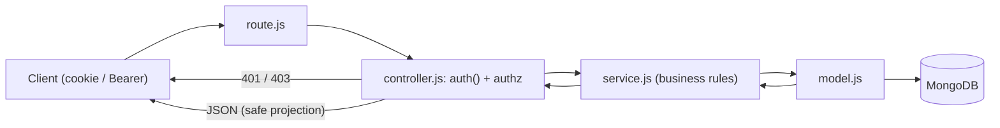

# API Reference & Conventions

> **Status:** Current — the conventions guide and entry point for the HTTP API. The full machine-readable reference is the <a href="./openapi.yaml">OpenAPI spec</a>.
> **Audience:** Engineers building against, or reviewers auditing, the API.  ·  **Last reviewed:** 2026-05-29

## Overview

The-Lab exposes a single HTTP API served by **Next.js 16 App Router route handlers** under `src/app/api/**`. This document describes the cross-cutting conventions — versioning, the authentication and authorization model, the standard error shape, and the layered request flow — and points to the OpenAPI 3.1 spec for the per-endpoint reference.

Most member-facing endpoints live under `/api/v1`. A few foundational endpoints (`next-auth` handlers, registration, the legacy `/api/seed`, `/api/test-toggle`, `/api/admin/*`, `/api/internal/*`, `/api/contact`, `/api/image-proxy`) sit at the API root. Some endpoints are **CTF/game** content or **operational** (seed/migration/test) utilities — see <a href="#ctf-and-operational-endpoints">CTF and operational endpoints</a>.

## Viewing the spec

The reference is <a href="./openapi.yaml">`docs/api/openapi.yaml`</a> (OpenAPI 3.1). Render it locally with either:

```bash
# Redocly (rich, single-page docs)
npx @redocly/cli preview-docs docs/api/openapi.yaml

# Swagger UI (interactive "try it out")
npx swagger-ui-watcher docs/api/openapi.yaml
```

GitHub also renders the YAML inline, and editors with an OpenAPI extension (e.g. the Redocly/Swagger VS Code plugins) give live preview and validation.

## Versioning

- The versioned surface is **`/api/v1`**. New member-facing features go there.
- Unversioned root paths exist for framework-required or legacy reasons: the `next-auth` catch-all (`/api/auth/[...nextauth]`), `/api/auth/register`, `/api/contact`, `/api/image-proxy`, and the operational/device endpoints under `/api/seed`, `/api/test-toggle`, `/api/admin/*`, and `/api/internal/*`.
- Public contracts are preserved across changes, or every consumer is updated in the same PR (see <a href="../audit/05-engineering-process.md">the engineering process</a>).

## Authentication model

Authentication uses **next-auth v5** with **JWT sessions** carried in a session **cookie** (`auth.js` / `auth.config.js` at the repo root). Three providers are configured: **Google**, **Discord**, and **Credentials** (email/password, bcrypt-hashed).

**Important:** `/api/*` is **not** covered by Next.js middleware. Each route protects itself — it calls `auth()` to resolve the session and enforces authorization at the edge (in the route or its controller). There is no global gate to rely on.

Identity is always derived from the **session**, never from a client-supplied `userID` or body field, for endpoints that gate on it. (A handful of endpoints — e.g. the showcase `POST /api/v1/portfolio` and some CTF endpoints — accept a `userID` in the body by design; these are flagged in the spec.)



### Authorization tiers

| Tier | How the route enforces it | Typical response when it fails |
|---|---|---|
| **Public** | No `auth()` gate. | n/a |
| **Session required** | `auth()` returns a session, else reject. | `401 Unauthorized` |
| **Admin only** | Session **and** `session.user.role === "admin"` (a few use `["admin","staff"]`). | `401` or `403` |
| **Owner or admin** | Session user matches the target `userID`, or is admin. | `403 Forbidden` |
| **Shared secret** | `Authorization: Bearer <INTERNAL_API_SECRET>`, constant-time compared, fails closed if unset. Device/IoT tier. | `401 Unauthorized` |
| **Signature** | HMAC/Ed25519 signature verified (Square / Discord webhooks); fails closed. | `401 Unauthorized` |

`admin` is the single privileged application role. The user API centralizes its access policy — privileged-role check, public-safe field projection, and the self-update field whitelist — in `src/app/api/v1/users/access.js`. Operational endpoints are gated by `src/lib/adminGuard.js` (`guardOperationalEndpoint()`), which is admin-only and blocks the endpoint in production (SEC-18).

**Note:** the OpenAPI spec records the auth requirement per operation as a `security` block (e.g. `sessionCookie`, `bearerSecret`, `squareSignature`) and documents the `401`/`403` responses where a route gates access. Auth status reflects what the handler actually enforces today, including a couple of spots where a stricter check is marked TODO in the source (e.g. badge writes require a session but not yet an admin role).

## Standard JSON shapes

### Responses

Successful responses return JSON with only the fields the client needs. User objects are returned in a **safe projection** — no password hashes, no encrypted blobs, and no other user's PII (see `src/app/api/v1/users/access.js`). Reusable resource schemas (`User`, `Bounty`, `Notification`, `Plan`, `Transaction`) are defined in the spec's `components.schemas`.

### Errors

Errors use a single envelope:

```json
{ "error": "Unauthorized" }
```

Messages are **generic** — no stack traces, internal hostnames, or sensitive values. Conventional status codes apply:

| Status | Meaning |
|---|---|
| `400` | Missing or invalid parameters. |
| `401` | Not authenticated (no/invalid session, or missing/invalid shared secret/signature). |
| `403` | Authenticated but not permitted (non-admin, not the owner, or disabled in production). |
| `404` | Resource not found. |
| `413` / `415` | Upload too large / unsupported media type (`/api/v1/upload`, `/api/image-proxy`). |
| `500` | Server error (also returned when a required secret/config is unset — fail closed). |
| `502` | Upstream failure (door controller, Square, image proxy). |

## Layered architecture

API features follow a strict layering so persistence stays isolated and routes stay thin:

```
route.js  →  controller.js  →  service.js  →  model.js  →  src/lib/database.js
(HTTP)       (auth + shape)    (business)     (persistence)  (single Mongo client)
```

- **`route.js`** maps HTTP verbs to controller methods.
- **`controller.js`** authenticates (`auth()`), authorizes (role/ownership), validates/derives the request shape, and translates results to HTTP responses.
- **`service.js`** holds business logic and calls its own models (and other features' **services**, never another feature's model).
- **`model.js`** is the only layer that touches MongoDB, via `src/lib/database.js`.

Reference implementations that follow this pattern well: `src/app/api/v1/bounties/*`, `src/app/api/v1/users/*`, and `src/app/api/v1/admin/plans/route.js`. Some older routes (e.g. `transactions/route.js`, `repairs/route.js`) query the database directly from the handler — these are known boundary exceptions, not the pattern to copy.

## CTF and operational endpoints

Two groups of endpoints are tagged distinctly in the spec and should not be confused with the production API:

- **`ctf`** — the "Hack the Lab" game (`holodeck/*`, `arcade/*`, `terminal/*`). This is **intentionally vulnerable** game content (planted flags, weak checks). Do not treat its behavior as a real defect or copy its patterns. See `CLAUDE.md` §14.
- **`operational`** — seed/migration/test utilities (`/api/seed`, `/api/test-toggle`, `/api/v1/*/seed`, `/api/v1/migrations/*`, `/api/admin/migrate-memberships`). These are admin-only and (where guarded with `productionDisabled`) unreachable in production (SEC-18).

The **`internal`** tag covers the device/IoT tier (`/api/internal/check-access`, `/api/internal/register-card`), authenticated by the shared `INTERNAL_API_SECRET` bearer secret rather than a session.

## Related documents

- <a href="./openapi.yaml">OpenAPI 3.1 spec</a> — the per-endpoint reference (paths, params, bodies, responses, auth).
- <a href="../architecture/overview.md">Architecture Overview</a> — system topology, trust boundaries, and the layered pattern in context.
- <a href="../README.md">Documentation hub</a> — index of all documentation.
- <a href="../audit/06-security-standards.md">Security standards</a> — binding security requirements that shape these conventions.

## Changelog

| Date | Change | Author |
|------|--------|--------|
| 2026-05-29 | Initial version (API conventions + OpenAPI reference) | app dev |
