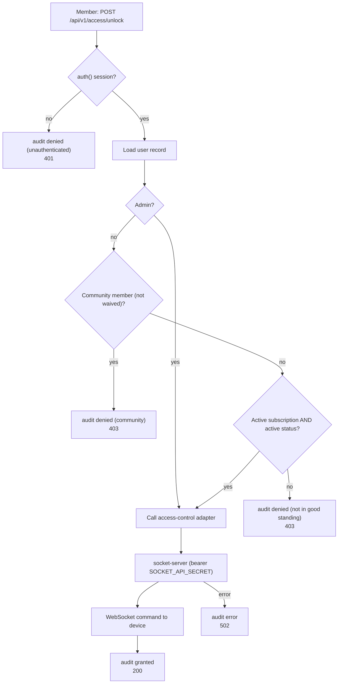
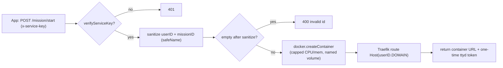

# Access Control (IoT Tier)

> **Status:** Current — describes the self-hosted `vps/` tier: physical door/equipment control and the "Hack the Lab" mission orchestrator.
> **Audience:** Engineers and operators working on physical access control or the CTF tier.  ·  **Last reviewed:** 2026-05-29

## Overview

The `vps/` tier is **self-hosted on the makerspace's VPS**, separate from the Vercel-deployed web app (the `.vercelignore` excludes it). It has two independent services:

- **`vps/socket-server.js`** — a WebSocket + HTTP server that talks to the lab's IoT door/equipment hardware. The Next.js app calls its **bearer-authenticated** control endpoints to unlock doors, toggle lights, and start card pairing; access decisions are **audit-logged**.
- **`vps/orchestrator/`** — a Fastify service that spawns per-user Docker containers for the "Hack the Lab" CTF missions, fronted by **Traefik**. Untrusted ids are allowlist-sanitized before they reach container/volume/image names or Traefik rules.

This document covers the door-unlock and card-pairing flows, the device authentication model, and the orchestrator's container isolation. The CTF content these support is **intentionally vulnerable game content** — see <a href="#hack-the-lab-the-orchestrator-is-game-infrastructure">the note below</a>.

## Trust model

There are two distinct shared secrets at this boundary, both env-only and fail-closed:

| Secret | Verified by | Guards |
|---|---|---|
| `SOCKET_API_SECRET` | `vps/lib/apiAuth.js` (`requireApiSecret`) | App → socket-server control endpoints (unlock, toggle-light) |
| device secrets (`DEVICE_SECRETS`) | `vps/lib/deviceAuth.js` (`verifyDeviceSecret`) | Hardware device → socket-server WebSocket auth |
| `INTERNAL_API_SECRET` | `src/app/api/internal/check-access/route.js` | Door panel → app card-lookup endpoint |
| `ORCHESTRATOR_SECRET` | `vps/orchestrator/lib/auth.js` (`x-service-key`) | App → orchestrator mission start |

All comparisons are **constant-time** (`crypto.timingSafeEqual` via `timingSafeEqualStr`) and **fail closed**: if the secret is unset, every request is rejected.

## Door unlock flow

The door-unlock endpoint is `src/app/api/v1/access/unlock/route.js`. It authenticates the member (`auth()`), evaluates "good standing", then calls the socket-server through the `src/lib/access-control.js` adapter. Every decision — denied or granted — is recorded with `auditLog` (`src/lib/audit.js`), which emits a structured JSON line with actor, target device, outcome, reason, and source IP, and never logs secrets or PII.

Good-standing rules in the route:
- **Admins** always pass.
- **Community-type** members (not waived) are denied — they have no door access.
- Otherwise the member must have an active subscription (`subscriptionStatus` `ACTIVE`/`PENDING`, or waived) **and** an active membership status (`active`/`probation`/`founder`).

**Note:** the route currently issues `toggleLight(deviceId)` rather than `unlockDoor(deviceId)` for the live switch (firmware reason documented in the route); both go through the same authenticated adapter. The socket-server then pushes a `UNLOCK`/`TOGGLE_LIGHT` command over the device's authenticated WebSocket.

### Socket-server endpoints

`vps/socket-server.js` exposes:
- `POST /api/unlock`, `POST /api/toggle-light` — **guarded by `requireApiSecret`** (bearer `SOCKET_API_SECRET`); look up the connected device and send the command over its WebSocket.
- `GET /api/status/:deviceId`, `GET /api/devices`, `GET /api/status/healthcheck`, `GET /` (read-only dashboard) — status/health.
- WebSocket: devices connect and send a `{ type: 'auth', deviceId, secret }` message; `verifyDeviceSecret` checks it against `DEVICE_SECRETS` (constant-time). With no `DEVICE_SECRETS` configured, all device auth is rejected.

## Card pairing flow

Two app endpoints start pairing mode on the door panel (both call the socket-server's `/api/v2/pairing/start`):

- **`src/app/api/admin/pair-card/route.js`** — staff/admin only (`role` ∈ `admin`/`staff`); fails closed otherwise (SEC-11). Sends a bearer `SOCKET_API_SECRET`.
- **`src/app/api/v1/memberships/pair-key/route.js`** — a member pairing their own card (or an admin). Requires `membership.accessKey.issued === true` (an admin must approve the key first), and **clears the old card code** (`membership.accessKey.code = null`) so the previous card stops working immediately before starting a 60-second pairing window.

The panel's later card scans are validated against the app via `src/app/api/internal/check-access/route.js`: a bearer `INTERNAL_API_SECRET` (constant-time) authorizes the panel, then the route matches the scanned `cardId` against `membership.accessKey.code` and applies the access rules (active/probation status, active subscription, or issued key — and never suspended/banned). It returns only `granted` plus minimal identity fields.

## CTF mission orchestrator

`vps/orchestrator/index.js` (Fastify + `dockerode`) exposes `POST /mission/start`, guarded by the `x-service-key` header against `ORCHESTRATOR_SECRET` (the service refuses to start if the secret is unset). It spins up a per-user, resource-capped Docker container for a mission and registers a Traefik route for it.

The untrusted `userID` and `missionID` flow into container/volume/image names and a Traefik `Host(...)` rule, so they are **allowlist-sanitized** by `vps/orchestrator/lib/sanitize.js` (`safeName`) before use:
- `userID` → alphanumeric only (`/[^a-zA-Z0-9]/g`).
- `missionID` → alphanumeric plus `-` and `_`.
- A value that sanitizes to empty is **rejected** (an empty id would collide across users — a shared `data_` volume / wildcard host — which is an isolation bug, not just a naming one).

Container hardening: 256 MB memory cap, 0.5 CPU, a per-user named volume (`data_<userID>`), and a one-time `ttyd` token for terminal access.

### Hack the Lab: the orchestrator is game infrastructure

The orchestrator and the mission containers it spawns exist to run **"Hack the Lab"**, the repo's intentionally-vulnerable CTF. The mission images (`crittercodes/<missionID>:latest`), planted flags, and mission filesystem (`vps/missions/**`) are **deliberate game content, not defects** — do not "harden" or report them (CLAUDE.md §14). What *must* stay secure is the boundary around them: the `ORCHESTRATOR_SECRET` auth, the id sanitization (so one player can't reach another's container/volume or escape into a Traefik/image context), and the resource caps. Those are real controls protecting real infrastructure that neighbors the game.

## Required env vars

| Variable | Where | Purpose |
|---|---|---|
| `ACCESS_CONTROL_API_URL` | `src/lib/access-control.js` | Socket-server base URL for unlock/toggle/status |
| `SOCKET_API_SECRET` | app adapters + `vps/lib/apiAuth.js` | Bearer secret for socket-server control endpoints |
| `WS_SERVER_URL` | pairing routes | Socket-server URL for `/api/v2/pairing/start` |
| `DEVICE_SECRETS` | `vps/socket-server.js` / `deviceAuth.js` | JSON map of `deviceId → secret` for device WebSocket auth |
| `INTERNAL_API_SECRET` | `internal/check-access/route.js` | Bearer secret the door panel uses for card lookup |
| `ORCHESTRATOR_SECRET` | `vps/orchestrator/index.js` | `x-service-key` for mission start |
| `DOMAIN`, `PORT` | orchestrator / socket-server | Traefik host base, listen ports |

## Related documents

- <a href="overview.md">Architecture Overview</a> — the App → VPS trust boundary and deployment topology.
- <a href="auth.md">Authentication &amp; Authorization</a> — the session/role checks the door-unlock and pairing routes rely on.
- <a href="data-model.md">Data model</a> — `membership.accessKey` (`issued`, `code`) and the membership status fields the access rules read.
- <a href="../audit/06-security-standards.md">Security standards</a> — constant-time secret verification and audit-logging requirements.

## Changelog
| Date | Change | Author |
|------|--------|--------|
| 2026-05-29 | Initial version | app dev |
