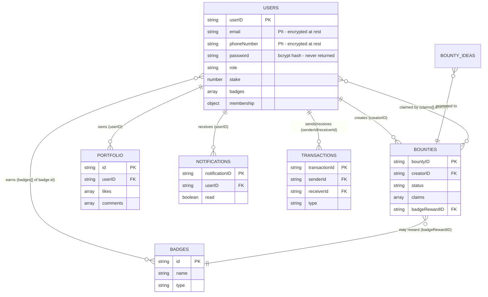

# Data Model

> **Status:** Current — describes the MongoDB collections as implemented in the model layer. Field shapes are derived from the `class.js` constructors and `model.js` queries.
> **Audience:** Engineers working on persistence, and reviewers checking data handling.  ·  **Last reviewed:** 2026-05-29

## Overview

The-Lab persists to a single **MongoDB** database, reached through the lazily-constructed singleton client in `src/lib/database.js`. Per the layered pattern (see <a href="overview.md">Architecture Overview</a>), only the **model layer** touches collections — features call `db.connect()` (or a `db.dbXxx()` helper) and then `database.collection(...)`.

Documents are largely **denormalized**: relationships between collections are by string business keys (`userID`, `bountyID`, …), not Mongo `ObjectId` references. Most domain entities carry their own prefixed UUID-derived id (`user-…`, `bounty-…`, `notif-…`, `idea-…`, `txn-…`), generated in the entity's `class.js` or `model.js`.

This document covers the major collections, their purpose, key fields, and the relationships between them. It is the companion to the access-policy and PII handling described in <a href="auth.md">Authentication &amp; Authorization</a>.

## Collection inventory

Collection names come from `src/lib/database.js` (the `db.dbXxx()` helpers) and from per-feature models that call `database.collection('…')` directly.

| Collection | Purpose | Primary key field | Defined / accessed in |
|---|---|---|---|
| `users` | Member accounts, profile, membership, access key, stake | `userID` | `src/app/api/v1/users/class.js`, `src/app/api/auth/[...nextauth]/model.js` |
| `bounties` | Bounty board tasks and claims | `bountyID` | `src/app/api/v1/bounties/class.js`, `.../model.js` |
| `bounty_ideas` | Proposed bounties awaiting promotion | `ideaID` | `src/app/api/v1/bounty-ideas/class.js`, `.../model.js` |
| `notifications` | Per-user in-app notifications | `notificationID` | `src/app/api/v1/notifications/class.js` |
| `plans` | Plan metadata + hidden/legacy id overlays (Square is source of truth) | `_id` (string doc ids) | `src/app/api/v1/plans/model.js` |
| `transactions` | Stake tips / awards ledger entries | `transactionId` | `src/app/api/v1/transactions/model.js` |
| `portfolio` | Community showcase projects | `id` (UUID) | `src/app/api/v1/portfolio/model.js` |
| `badges` | Badge definitions (system + CTF) | `id` (slug) | `src/app/api/v1/badges/model.js` |
| `announcements` | Site-wide announcements | `_id` (`ObjectId`) | `src/app/api/v1/announcements/class.js` |
| `processed_webhook_events` | Square webhook idempotency keys | — | `src/lib/webhookIdempotency.js` |
| `config` | Webhook/runtime config docs | `_id` | `src/lib/squareWebhook.js` |
| `contact_submissions` | Contact-form submissions | — | `src/lib/database.js` (`dbContactSubmissions`) |
| `checkins`, `repairs`, `bugs`, `holodeck_completions`, `arcade` sessions/jackpot | Feature-specific (check-in, repairs, bug reports, CTF) | varies | respective `model.js` |

**Note:** `plans` is unusual — it does **not** store member subscriptions. Square's Catalog is the source of truth for plan/variation data (`src/app/api/v1/plans/model.js` calls the Square `catalogApi`); the collection holds only overlay documents keyed by fixed string `_id`s (`hidden_plans`, `hidden_variations`, `plan_meta`, `legacy_plans`) to hide/annotate Square plans. A member's subscription state lives under `users.membership` instead.

## Core entity relationships

## `users`

The central collection. The document shape is the `User` constructor in `src/app/api/v1/users/class.js`. Identity, profile, the stake economy, and the membership/access-control state all live here.

Key top-level fields:

- `userID` — business key, `user-<8 hex>`.
- `firstName`, `lastName`, `username`, `image`, `bio`, `boardPosition`.
- `email` — **PII, encrypted at rest** (see <a href="#pii-fields-encryption">PII fields</a>). Also used as the login lookup key.
- `phoneNumber` — **PII, encrypted at rest**.
- `password` — bcrypt hash (`bcryptjs`); never included in any API response (stripped by `stripSensitive` in `src/app/api/v1/users/access.js`).
- `role` — defaults to `'user'`; `'admin'` is the single privileged role (and `'staff'` appears in the card-pairing guard). Drives authorization.
- `status` — account verification: `'unverified'` → `'verified'`.
- `provider`, `discordId`, `discordHandle`, `googleId` — auth provider linkage.
- `stake` (number) and `stakeHistory` (array) — the community-involvement points economy; `badges` (array of badge `id`s).
- `privacy` (`showEmail`, `showDiscord`, `showPhone`), `notificationPreferences` (`email`, `discord`), `socials`, `interests`, `isPublic`.
- `verificationToken` — short-lived email-verification JWT (cleared on verify).
- `createdAt`, `updatedAt`, `lastLogin`.

### `membership` sub-document

A nested object that holds membership and **physical-access** state — the security-sensitive part of the record:

- `type` — `'community'` or `'co-op'`.
- `status` — lifecycle: `registered`, `applicant`, `contacted`, `onboarding`, `probation`, `active`, `suspended` (and `banned` is checked in access logic).
- `applicationDate`, `contacted`, `contactDate`, `onboardingComplete`, `onboardingDate`.
- `volunteerLog` — array of `{ id, date, hours, description, verifiedBy, status }`. Member-submitted entries are forced to `status: 'pending'` and cannot be self-approved (`reconcileVolunteerLog` in `access.js`).
- `accessKey` — `{ issued, type, issuedDate, code, revokedReason }`. `accessKey.code` is the access-card identifier matched at the door (see <a href="access-control-iot.md">Access control (IoT tier)</a>); `issued` gates pairing.
- `subscriptionStatus` (e.g. `ACTIVE`), `gracePeriodStartedAt`, `isWaived` — billing/access state driven by Square webhooks and the login-time grace-period check in `auth.js`.
- `notes` — array of `{ date, adminId, text }`.

**Write surface:** only the fields in `SELF_WRITABLE_FIELDS` / `SELF_WRITABLE_MEMBERSHIP_FIELDS` (`access.js`) may be set by a non-admin on their own record; access-granting fields (`status`, `accessKey`, `subscriptionStatus`, `isWaived`, …) are server-controlled. See <a href="auth.md">Authentication &amp; Authorization</a>.

### PII fields & encryption

`email` and `phoneNumber` are **encrypted at rest**. The current scheme (`src/app/api/auth/[...nextauth]/service.js`) uses `aes-256-cbc` with a fixed all-zero IV (deterministic), so `email` doubles as a lookup key — `UserModel.findByEmail(AuthService.encryptEmail(email))`. The planned hardening to authenticated **AES-256-GCM** plus a keyed **HMAC blind index** (so lookups don't depend on deterministic ciphertext) is documented in the <a href="../migrations/sec-23-pii-encryption-gcm-blind-index.md">SEC-23 migration plan</a>. The hardcoded fallback key has already been removed; `ENCRYPTION_KEY` is env-only.

## `bounties`

Bounty-board tasks. Shape from `src/app/api/v1/bounties/class.js`.

- `bountyID` (`bounty-<8 hex>`), `title`, `description`.
- `creatorID` — `userID` of the author.
- `rewardType` (`'hours'`, `'crypto'`, `'custom'`), `rewardValue`, `stakeValue` (points awarded on completion).
- `requirements` (array), `recurrence` (`none`/`daily`/`weekly`/`monthly`), `startsAt`, `endsAt`, `isInfinite`, `imageUrl`.
- `badgeRewardID` — optional `badges.id` granted on completion.
- `status` — `open`, `assigned`, `completed`, `verified`, `cancelled`.
- `assignedTo`, `assignedAt` — legacy single-claim fields.
- `claims` — array of `{ claimID, userID, claimedAt, status, submission: { text, date } }` (the current multi-claim model); `submissions` is the legacy single-claim field.
- `createdAt`, `updatedAt`, `completedAt`.

## `bounty_ideas`

Proposed bounties awaiting an admin to promote them into `bounties`. Shape from `src/app/api/v1/bounty-ideas/class.js`: `ideaID` (`idea-<hex>`), `title`, `description`, `rewardType`, `rewardValue`, `stakeValue`, `requirements`, `recurrence`, `isInfinite`, `imageUrl`, `createdAt`, `updatedAt`. (No `creatorID` in the constructor.)

## `notifications`

Per-user in-app notifications. Shape from `src/app/api/v1/notifications/class.js`: `notificationID` (`notif-<8 hex>`), `userID` (recipient), `type` (`info`/`success`/`warning`/`error`), `title`, `message`, `link`, `read` (default `false`), `metadata`, `createdAt`.

## `transactions`

The stake-economy ledger (tips between members and admin awards). Shape from `src/app/api/v1/transactions/model.js` (`createTransaction`): `transactionId` (`txn-<uuid>`), `senderId`, `receiverId`, `amount`, `type` (e.g. `'tip'`), `status` (`'completed'` / `'pending'`), `metadata` (e.g. `{ receiverDiscordId }` for tips to a not-yet-registered Discord user, claimed on their first login), `createdAt`, `updatedAt`. The actual stake balance transfer is performed by the wallet service against `users`; this collection is the audit/meta record.

## `portfolio`

Community showcase projects. Shape from `src/app/api/v1/portfolio/service.js` (`createItem`): `id` (UUID), `userID` (owner), `title`, `description`, `imageUrls` (array of S3 URLs), `likes` (array of `userID`s, manipulated with `$addToSet`/`$pull`), `comments` (array of objects with `userID`), `createdAt`. Reads join `users` (`$lookup` on `userID`) and project only public author fields. `PortfolioModel.getQuery` accepts either the UUID `id` or a 24-hex `_id`.

## `badges`

Badge definitions, both system badges and "Hack the Lab" CTF badges. Shape from `src/app/api/v1/badges/model.js` and the seed route: `id` (slug, unique), `name`, `description`, `type` (defaults to `'system'`), `imageUrl` (generated via Gemini — see <a href="integrations.md">Integrations</a>), `createdAt`, `updatedAt`. Members reference badges by `id` in their `users.badges` array.

## `announcements`

Site-wide announcements. Unlike the domain entities above, this uses Mongo `ObjectId`s. Shape from `src/app/api/v1/announcements/class.js`: `_id` (`ObjectId`), `title`, `content`, `type` (`info`/`warning`/`alert`/`success`), `isActive`, `createdBy` (`ObjectId`), `expiresAt`, `createdAt`, `updatedAt`. The class exposes `toDocument()` to strip `undefined` fields before persistence.

## Input safety

Body-driven writes strip Mongo `$`-prefixed operator keys via `src/lib/mongoSanitize.js` (`stripMongoOperators`), surfaced as `stripOperatorKeys` in `access.js`. User lookups escape/anchor regex input so user-supplied strings can't act as `RegExp`. See the security standards in <a href="../audit/06-security-standards.md">06-security-standards.md</a>.

## Related documents

- <a href="overview.md">Architecture Overview</a> — the layered persistence pattern and trust boundaries.
- <a href="auth.md">Authentication &amp; Authorization</a> — the user access policy, public projection, and self-update whitelist.
- <a href="../migrations/sec-23-pii-encryption-gcm-blind-index.md">SEC-23 PII-encryption migration plan</a> — the planned GCM + blind-index scheme for `email`/`phoneNumber`.
- <a href="integrations.md">Integrations</a> — Square (plans/subscriptions), S3 (portfolio/badge images), Gemini (badge images).

## Changelog
| Date | Change | Author |
|------|--------|--------|
| 2026-05-29 | Initial version | app dev |
