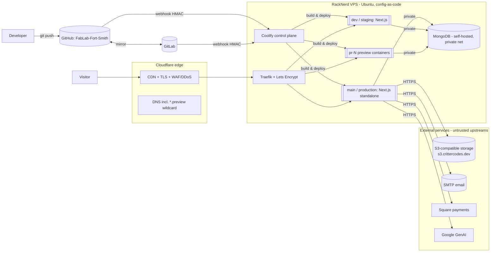

# Architecture Overview — FabLab Deploy Platform

**Goal:** replicate Vercel's instant-deploy developer experience — *push to git → automatic
build → atomic, zero-downtime deploy → live on HTTPS, with a preview URL per branch/PR* — on
our own VPS, and run the existing **The-Lab Next.js app** there (migrated off Vercel).

Status: **design** (no infra provisioned; app not yet moved). Decisions: [`adr/`](./adr/).

---

## 1. The "seven features" of Vercel, and how we cover each

| # | Vercel feature | Our implementation | Difficulty |
|---|----------------|--------------------|:---:|
| 1 | Git-push deploy | Coolify GitHub App + GitLab webhook trigger build on push | easy |
| 2 | **Preview deployments** (branch/PR → unique URL) | Coolify native preview environments; wildcard `pr-<n>.preview.<domain>`; isolated per-PR network; auto-cleanup | medium |
| 3 | Atomic zero-downtime swap | Coolify builds new container, Traefik swaps traffic, old drains | easy–med |
| 4 | Instant rollback | Coolify deployment history; (during migration, Vercel/DNS is also a rollback) | medium |
| 5 | Automatic HTTPS | Coolify Traefik + Let's Encrypt; wildcard (DNS-01) for previews | easy |
| 6 | Build detection | The app's existing **Dockerfile** / Nixpacks (Next.js `output: 'standalone'`) | medium |
| 7 | Global edge CDN | **Cloudflare** (free) proxies the VPS — caching, edge TLS, DDoS | n/a (offloaded) |

**Gap we close ourselves:** Vercel's *Deployment Checks* have no native Coolify equivalent — we
enforce tests/SAST/SCA/secret-scan as **merge-blocking CI gates** (`@rules/workflow-cicd.md`).

---

## 2. System diagram (C4 — container level)

Trust boundaries: **developer→forge**, **forge→Coolify webhook**, **internet→edge**,
**edge→VPS origin**, **Coolify→build→runtime**, **app→MongoDB**, **app→external services**,
plus the **browser→app payment flow** (Square hosted fields). All threat-modeled in
[`../security/threat-model.md`](../security/threat-model.md).

---

## 3. How a deploy flows (the "instant" path)

1. Developer pushes to a branch (mirrored across forges — ADR 0003).
2. Forge fires a **signed webhook** to Coolify (HMAC verified before any action).
3. Coolify builds (app Dockerfile) and deploys:
   - `main` → **production** (`<domain>`); other branch/PR → **preview**
     (`pr-<n>.preview.<domain>`, isolated, **no production secrets/data**).
4. On success, **Traefik** issues/renews TLS and **atomically swaps** traffic; old container
   drains (zero-downtime).
5. Cloudflare caches static assets at the edge (feature #7).
6. The app talks to **self-hosted MongoDB** over the private network and to **external**
   S3/SMTP/Square/GenAI over HTTPS.
7. Merge/close PR → Coolify tears down that preview. Bad deploy → rollback (Coolify history;
   during migration, DNS back to Vercel).

CI runs ahead of/parallel to step 2 (lint, tests+coverage, SAST, SCA, secret-scan, image scan);
production promotion gated on green CI.

---

## 4. Mapping to the repo / folder structure

| Concept | Vercel | Here |
|---|---|---|
| The site (source) | Project | `lab-site/the-lab/` (one lowercase folder, single copy) |
| Production | Production deployment | Coolify env from `main` branch → `<domain>` |
| Staging | — | Coolify env from `dev` branch → `dev.<domain>` |
| Preview | Preview deployment | per-PR Coolify env → `pr-<n>.preview.<domain>` (ephemeral) |
| Additional site | New project | `lab-site/<new-site>/` (own Coolify application) |
| The platform | (Vercel's infra) | `lab-stack/` (Coolify + Traefik + MongoDB + IaC) |

**One folder per site; environments come from branches** (not duplicated code folders — ADR
0005), mirroring Coolify's *project → environment* model so source and deploy topology stay
in sync.

---

## 5. Non-goals / explicit limits (be honest)

- **Not a true global edge platform** — one VPS region; Cloudflare gives edge *caching* + TLS,
  not edge *compute*. Fine for FabLab scale.
- **Not multi-node HA initially** — one VPS hosts app **and** MongoDB = SPOF. Mitigated by
  automated **encrypted backups + tested restore** (`@rules/workflow-data-lifecycle.md`); HA /
  managed DB (ADR 0007 alternative) is a later decision.
- **PCI scope is kept minimal** — Square hosted/tokenized fields (SAQ-A); we store tokens/refs,
  **never** PAN/SAD (`@rules/std-pci.md`).
- **Migration, not greenfield** — runs in parallel with Vercel until cutover (ADR 0006).

## 6. References

- Coolify docs: https://coolify.io/docs · C4 model: https://c4model.com · Mermaid: https://mermaid.js.org
- ADR 0002 (engine choice + sources), 0006 (migration), 0007 (data services).
