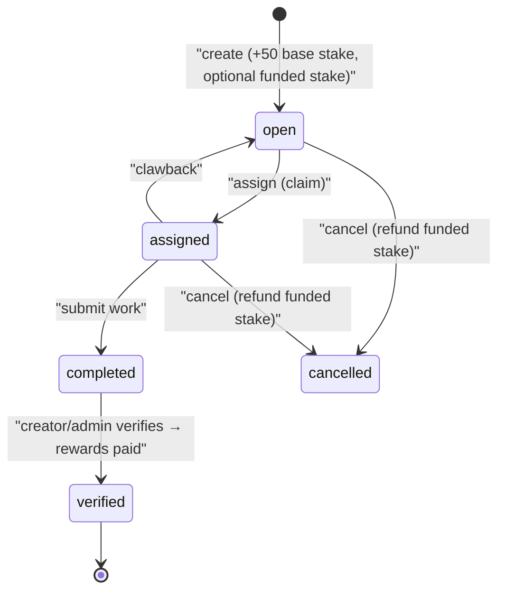

# Bounties & Rewards

> **Status:** Current — feature documentation for the bounty board, the "stake" rewards economy, volunteer hours, and badges. Cross-document links use HTML anchors so they render as clickable links on GitHub.
> **Audience:** Engineers and reviewers working on bounties, the wallet, transactions, or badges.  ·  **Last reviewed:** 2026-05-29

## Overview

The-Lab runs a community rewards economy. Members earn **stake** (a points currency) and **volunteer hours** by completing **bounties**, and collect **badges** for milestones. Stake can be tipped between members, awarded by admins, spent to fund a bounty, and refunded. Volunteer hours count toward membership standing (see <a href="./auth-onboarding.md">Auth & Onboarding</a>).

The bounty feature is one of the codebase's reference implementations of the layered `route → controller → service → model → class` pattern (`src/app/api/v1/bounties/*`): the route is thin, the controller authenticates and forces server-derived identity, and the service holds the business logic. This document covers the bounty lifecycle, the stake wallet, volunteer hours, the bug-bounty channel, check-ins, and badges.

## Prerequisites

- Read the layered-API section of the <a href="../architecture/overview.md">Architecture Overview</a>.
- Stake amounts and badge definitions live in `src/lib/constants.js`.

## Stake — the rewards currency

Stake lives on the user record (`user.stake`) with an append-only `stakeHistory` log. The single source of truth for moving stake is `WalletService` (`src/app/api/v1/wallet/service.js`):

| Method | Purpose |
|---|---|
| `getBalance(userID)` | Current `stake` balance |
| `addStake(userID, amount, reason, type, metadata)` | Credit (amount must be positive); `$inc` + `$push` to `stakeHistory` |
| `deductStake(userID, amount, reason, type, metadata, allowOverdraft)` | Debit; rejects with "Insufficient funds" unless `allowOverdraft` |
| `transferStake(from, to, amount, reason, type)` | Debit sender then credit receiver, with a compensating refund if the credit step fails |

`TransactionService` (`src/app/api/v1/transactions/service.js`) layers user-facing flows on top and records a row in the transactions collection (`TransactionModel`):

- **Tip** — `POST /api/v1/transactions/tip` (any authenticated user; sender is the session user). Transfers stake to a known member, or — if the recipient is only known by Discord id — **escrows** it as a `pending` transaction. `claimPendingTips(userID, discordId)` (called from the Discord sign-in flow in `auth.js`) releases escrowed tips when that Discord account links.
- **Award** — `POST /api/v1/transactions/award` (**admin-only**; verifies `session.user.role === 'admin'`). Credits stake without debiting anyone; awards to unknown Discord users sit as `pending` until claimed.
- **List** — `GET /api/v1/transactions` returns transactions with `type`/`status` filters and pagination.

## Bounty lifecycle

A bounty (`src/app/api/v1/bounties/class.js`) has a `status` of `open → assigned → completed → verified` (plus `cancelled`), or — for an **infinite** bounty — a `claims[]` array where each claim moves `active → submitted → verified`. The HTTP surface is:

- `GET /api/v1/bounties` — list (filter by `status`/`creatorID`, paginated) or fetch one by `bountyID`; only bounties whose `startsAt` has passed are returned.
- `POST /api/v1/bounties` — create (auth required; `creatorID` is **forced to the session user** in the controller).
- `PUT /api/v1/bounties?bountyID=…&action=…` — the verb router: `assign`, `submit`, `verify`, `cancel`, `edit`, `clawback`, `like`, `comment`, `share`.
- `DELETE /api/v1/bounties?bountyID=…` — delete (creator or admin).

### Create

`BountyService.createBounty` computes the total stake as a **50-point base** plus any `stakeValue` the creator funds. If a **non-admin** funds extra stake, that amount is **deducted from their wallet** at creation (`bounty_creation`). Creation fans out notifications to active members (in-app/email via `NotificationService`) and posts an embed to the Discord bounty channel.

### Claim & submit

`assignBounty` claims the bounty: a standard bounty moves to `assigned`/`assignedTo`; an infinite bounty appends an `active` claim (rejecting a duplicate active claim or an expired bounty). `submitBounty` attaches the submission — `completed` for a standard bounty, or the claim's status flips to `submitted`. Both notify the creator.

### Verify & reward

`verifyBounty` (creator or admin only) is where rewards pay out, via `WalletService.addStake`:

- **Stake** — the bounty's `stakeValue` is credited to the assignee (`bounty_completion`).
- **Volunteer hours** — if `rewardType === 'hours'`, an **approved** entry is appended to the member's `membership.volunteerLog` with the `rewardValue` hours.
- **Badges** — checks and grants, with a notification, `VOLUNTEER_STAR` (10+ total hours), `BOUNTY_HUNTER` (5+ completed bounties), and any explicit `badgeRewardID` on the bounty.

For a **recurring** bounty (`daily`/`weekly`/`monthly`), `spawnNextRecurringBounty` schedules the next instance, decaying the funded stake by the base + a small decay each cycle.

### Cancel, delete, clawback, refund

`cancelBounty`/`deleteBounty` (creator or admin) refund the **funded** stake (total minus the 50 base) to a non-admin creator when the bounty hasn't paid out. `clawbackBounty` reverses an assignment (back to `open`) or removes an infinite-bounty claim. `editBounty` is blocked once a bounty is `completed`/`verified`.

## Volunteer hours

Volunteer hours accrue in `user.membership.volunteerLog` (each entry `{ id, date, hours, description, status, verifiedBy }`). Bounties with `rewardType: 'hours'` write **approved** entries directly on verification; hours submitted by other paths await admin approval (the approval flow in `UsersService.updateUser` emits an admin notice and an approval notification to the member). The lab's monthly requirement is `Constants.REQUIRED_VOLUNTEER_HOURS` (4), which the status nudge logic surfaces to probation/active members (see <a href="./auth-onboarding.md">Auth & Onboarding</a>).

## Bug bounty

`/api/v1/bugs` (`bugs/route.js` → `controller.js` → `service.js`) lets members report defects:

- `GET` lists bugs (enriched with submitter info).
- `POST` creates a bug (auth required; `submittedBy` is the session user), default `severity: 'low'`, `status: 'open'`.
- `PUT` updates status (**admin-only**, returns 403 otherwise). Verifying a bug awards an optional `stakeReward` and grants the `BUG_SQUASHER` badge (which itself carries a 100-stake reward) with a notification.

## Check-ins

`/api/v1/checkin` (`checkin/route.js`) tracks physical presence. `GET` returns the caller's check-in status (or, admin-only with `?mode=log`, the check-in log). `POST` with `{ action: 'checkin' | 'checkout' }` toggles `isCheckedIn`, writes a `CheckInModel` record, and syncs the Discord "checked-in" role. The fifth check-in grants the `LAB_REGULAR` badge (+5 stake).

## Badges

Badges are catalog entries seeded from `Constants.BADGES` in `src/lib/constants.js`, with `type` of `admin` (manually granted) or `system` (auto-awarded). Some carry a `stakeReward`. The HTTP surface:

- `GET /api/v1/badges` — list all badges (optional `?type=` filter).
- `POST /api/v1/badges` — create a badge (auth required).
- `GET|PUT|DELETE /api/v1/badges/{badgeID}` — fetch/update/delete a single badge (mutations require auth).

A user's earned badges are stored on `user.badges`. System badges are granted inline by the relevant feature service (bounties, bugs, portfolio, check-ins) when its milestone is hit. Examples: `BOUNTY_HUNTER` (5+ bounties), `VOLUNTEER_STAR` (10+ hours), `BUG_SQUASHER`, `LAB_REGULAR`, `SHOWCASE_PIONEER`, `COMMUNITY_VOICE`.

**Note:** the `BADGES` map also contains the "Hack the Lab" CTF badges (e.g. `SCRIPT_KIDDIE`, `WHITE_HAT`, `ROOTKIT_MASTER`). Those belong to the intentionally-vulnerable game and are awarded by the holodeck/arcade/terminal zones — see the game design docs and `CLAUDE.md` §14.

## Related documents

- <a href="./community.md">Community</a> — the showcase, feed, notifications, and leaderboards that surface stake, hours, and bounty wins.
- <a href="./auth-onboarding.md">Auth & Onboarding</a> — onboarding stake rewards and the volunteer-hours membership requirement.
- <a href="../architecture/overview.md">Architecture Overview</a> — the layered-API pattern bounties exemplify.
- <a href="../../CLAUDE.md">CLAUDE.md</a> — engineering & secure-SDLC rules.

## Changelog

| Date | Change | Author |
|------|--------|--------|
| 2026-05-29 | Initial version | app dev |
