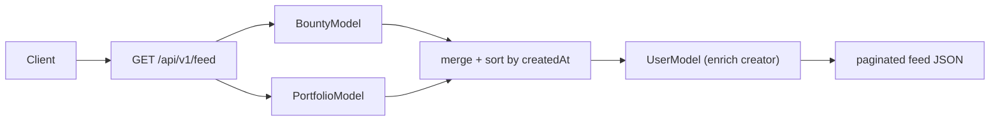

# Community

> **Status:** Current — feature documentation for the showcase/portfolio, the community feed, notifications, leaderboards, and contact submissions. Cross-document links use HTML anchors so they render as clickable links on GitHub.
> **Audience:** Engineers and reviewers working on the community-facing surfaces.  ·  **Last reviewed:** 2026-05-29

## Overview

The community surfaces give members a place to show their work and stay engaged: a **portfolio/showcase** of projects, a merged **activity feed**, per-user **notifications** (in-app, with optional email/Discord fan-out), **leaderboards**, and an admin view of public **contact submissions**. Several of these tie back into the rewards economy in <a href="./bounties-rewards.md">Bounties & Rewards</a> — posting and commenting can earn badges and stake, and the leaderboards rank by stake, hours, and bounty wins.

This document covers each surface, its HTTP endpoints, and how it is scoped to the calling user.

## Prerequisites

- Read the request-lifecycle and auth sections of the <a href="../architecture/overview.md">Architecture Overview</a>.
- Familiarity with the stake/badge economy in <a href="./bounties-rewards.md">Bounties & Rewards</a>.

## Portfolio / showcase

The showcase lets members post projects (image galleries with a title and description). It follows the layered pattern (`src/app/api/v1/portfolio/*`):

- `GET /api/v1/portfolio` — list items (filters: `userID`, `id`; params `limit`, `skip`, `sort`).
- `POST /api/v1/portfolio` — create an item (requires `userID`, `title`, and at least one `imageUrls` entry).
- `PUT /api/v1/portfolio` — act on an item by `action`: `comment`, `share`, or (default) toggle `like`.

`PortfolioService` (`portfolio/service.js`) drives the side effects:

- **First post** grants the `SHOWCASE_PIONEER` badge (+10 stake) and posts the project to the Discord showcase channel (`Constants.DISCORD_SHOWCASE_CHANNEL_ID`).
- **Like / comment** notify the item owner (skipping self-notification). Commenting on 3+ distinct items grants the `COMMUNITY_VOICE` badge (+5 stake).
- **Share** sends an in-app notification to the recipient.

## Community feed

`GET /api/v1/feed` (`feed/route.js` → `controller.js` → `service.js`) is a read-only, merged activity stream. `FeedService.getFeed(limit, skip)` pulls recent **bounties** and **showcase** items, tags each with its `type` (`bounty` / `showcase`), merges and sorts them by `createdAt` descending, paginates, and enriches each entry with its creator's public identity (name, username, image, `discordId`). It composes the bounty and portfolio **models** to build a unified view.

## Notifications

Notifications are **per-user private data** and are strictly **session-scoped** — the owner is always derived from the session, never from a client-supplied `userID` (SEC-14). The endpoints (`notifications/route.js` → `controller.js`):

- `GET /api/v1/notifications` — returns the **session user's** notifications (most recent first). 401 if unauthenticated.
- `POST /api/v1/notifications` — create a notification; **admin-only** (403 otherwise). Application flows create notifications server-side via `NotificationService.create()`, not through this endpoint.
- `PUT /api/v1/notifications` — `markRead` (by `notificationID`) or `markAllRead`, both scoped to the session user.

`NotificationService.create` (`notifications/service.js`) writes the in-app record, then optionally fans out:

- **Discord DM** — only if the user has a linked `discordId` **and** has opted in (`notificationPreferences.discord === true`).
- **Email** — only if the user has an email **and** opted in (`notificationPreferences.email === true`) and an `emailType` is provided; the address is decrypted at send time and routed to the matching template (`bounty_new`, `bounty_claimed`, `bounty_verified`, `nudge`, `volunteer_approved`, `profile_completion`, …).

The create path strips `$`-prefixed (Mongo operator) keys from the incoming data, including nested `metadata`, so a crafted body can't inject operators (SEC-19). Read/mark operations in `NotificationModel` are matched on `{ notificationID, userID }` / `{ userID }`, so a member can only touch their own notifications.

## Leaderboards

`GET /api/v1/leaderboard` (`leaderboard/route.js`) returns three top-10 rankings, each fetched independently so one failing query doesn't break the others:

| Ranking | Source | Basis |
|---|---|---|
| `topStake` | `UserModel.getTopStake(10)` | highest `stake` (projects only public-safe fields) |
| `topVolunteers` | `UserModel.getTopVolunteerHours(10)` | summed approved `membership.volunteerLog` hours (aggregation) |
| `topBountyHunters` | `BountyModel.getTopBountyHunters(10)` | count of `verified` bounties/claims per user |

The projections expose only display identity (name, username, image, `userID`) and the ranking metric — never the encrypted email or other PII.

## Contact submissions

`GET|PATCH /api/v1/contact-submissions` (`contact-submissions/route.js`) backs the admin review of public "contact us" messages: `GET` lists submissions and `PATCH` updates a submission's `status` by `id`. This is an internal admin surface.

**Security:** this endpoint reads/mutates submission records directly via the model and does not itself perform an `auth()`/role check in the route — it relies on being reachable only from admin tooling. Treat any change here as security-relevant and add an explicit session + admin guard if the surface is exposed more broadly; see `CLAUDE.md` §5.

## Related documents

- <a href="./bounties-rewards.md">Bounties & Rewards</a> — the stake/badge economy these surfaces display and feed.
- <a href="./auth-onboarding.md">Auth & Onboarding</a> — notification preferences and the member profile.
- <a href="../architecture/overview.md">Architecture Overview</a> — request lifecycle, layered API, and trust boundaries.
- <a href="../../CLAUDE.md">CLAUDE.md</a> — engineering & secure-SDLC rules.

## Changelog

| Date | Change | Author |
|------|--------|--------|
| 2026-05-29 | Initial version | app dev |
