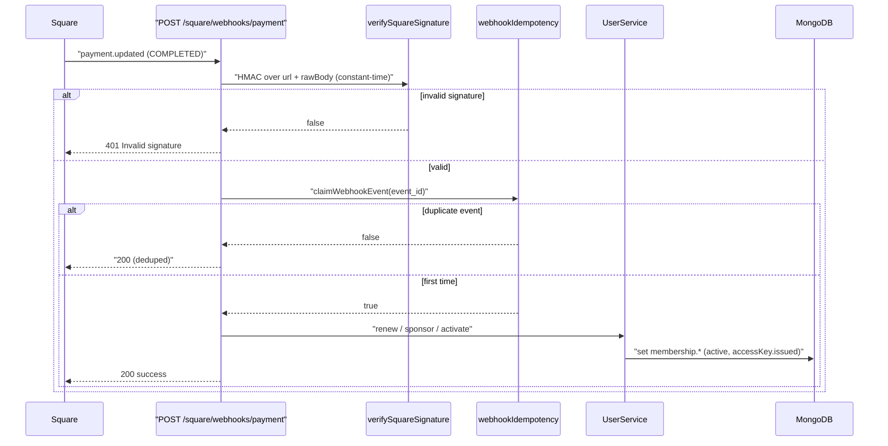

# Memberships & Payments

> **Status:** Current — feature documentation for plans, Square subscriptions, sponsorship, grace periods, and the payment-webhook state machine. Cross-document links use HTML anchors so they render as clickable links on GitHub.
> **Audience:** Engineers, reviewers, and operators working on billing, memberships, or the Square integration.  ·  **Last reviewed:** 2026-05-29

## Overview

Membership billing is powered by **Square**: catalog **subscription plans**, recurring **subscriptions**, one-time and recurring **sponsorships** (gifted memberships), and **donations**. Square's hosted checkout collects payment; **webhooks** then drive the member's access state — activating, renewing, applying a grace period, or revoking access. All card data stays with Square (we never store a PAN/CVV), keeping the app out of PCI scope.

The webhook handler is the heart of the membership state machine. It is **signature-verified** in constant time and **idempotent** so Square's at-least-once redelivery can never double-apply an effect. This document covers the plan catalog, the checkout-and-confirm flow, sponsorship, grace periods, and that webhook machine.

The Square SDK is wrapped behind `src/lib/square.js`; never instantiate the client inside a route handler. See the <a href="../architecture/overview.md">Architecture Overview</a> for the integration map and the <a href="../migrations/square-v44-migration.md">Square SDK v44 migration plan</a> for the in-flight SDK upgrade.

## Prerequisites

- A Square application with a configured location (`SQUARE_LOCATION_ID`) and a webhook subscription whose signing key is `SQUARE_WEBHOOK_SIGNATURE_KEY`.
- Familiarity with the membership-status progression in <a href="./auth-onboarding.md">Auth & Onboarding</a> — payments are what move a member into `active` and out to `suspended`.

## Plans

A plan is a Square **catalog `SUBSCRIPTION_PLAN`** with one or more **variations** (e.g. monthly/annual cadences).

- **Member-facing list** — `GET /api/v1/memberships` (`src/app/api/v1/memberships/route.js`) lists active plans with a resolved price/currency for each. `DELETE` cancels a member's subscription in Square and unsets their `membership`; `PUT` toggles a locker add-on.
- **Admin management** — `src/app/api/v1/admin/plans/route.js` is **admin-only** (every verb checks `session.user.role === "admin"`):
  - `GET` lists plans with live subscriber counts and prices (and, with `?subscribers=<planId>`, the subscriber roster — exposing only `userID`/name, never the encrypted email).
  - `POST` creates a plan with flexible variations (optional trial phase + a `STATIC`-priced billing phase).
  - `PUT` renames a plan, edits variation prices, appends variations, stores description/benefit metadata, marks plans legacy, or restores hidden ones. When Square blocks a deletion because of subscription history, the plan/variation is **hidden locally** (tracked in the `plans` collection under `hidden_plans` / `hidden_variations`) instead.
  - `PATCH` pauses/resumes/cancels or migrates (`swapPlan`) a single subscription.
  - `DELETE` archives a plan (optionally cancelling subscribers first), falling back to local hide if Square refuses.

## Checkout & confirmation

A member starts checkout at **`POST /api/v1/memberships/{planID}/checkout`** (`[planID]/checkout/route.js`):

1. Authenticates via `auth()` and reads the plaintext email from the session (the DB email is encrypted).
2. Ensures a Square **customer** exists for the user (creating one with `referenceId: userID` and storing `membership.squareCustomerId`).
3. Builds a display label from the variation + parent plan, applies a **coupon** discount if a `couponCode` resolves to a catalog `DISCOUNT` (percentage or fixed amount), and creates a Square `quickPay` **payment link**.
4. For the no-coupon path, attaches `subscriptionPlanId` so Square creates the subscription automatically at checkout. The redirect target is the confirm endpoint.

On return, **`GET /api/v1/memberships/confirm`** (`confirm/route.js`) reconciles the result. It resolves the Square `customerId` (via the `transactionId` payment, or the `checkoutId` → payment link → order), finds or — for the coupon/`CUSTOM_AMOUNT` path — creates the subscription, then sets the member to `active`/`co-op` with `subscriptionStatus: ACTIVE`, `accessKey.issued: true`, and records the plan/variation name. First-time activation awards the `SUBSCRIBE` stake (25). If nothing can be resolved yet it redirects with `?pending=true`.

Members manage their live subscription through **`/api/v1/memberships/subscription`** (`subscription/route.js`), which authorizes the caller against the target `userID` (or admin):

- `GET` returns live subscription details (status, plan/variation, price, cadence, charged-through/cancel/pause dates).
- `POST` syncs the stored subscription from Square (searching by stored customer IDs and, as a fallback, by the customer's email — only to discover customer IDs, never to mutate a different user).
- `PATCH` performs `cancel` / `pause` / `resume`, mirroring the resulting access state onto the user record.

After an admin issues the access key (`accessKey.issued`), **`POST /api/v1/memberships/pair-key`** (`pair-key/route.js`) lets the member trigger card-pairing mode on the door panel: it authorizes the caller, requires `accessKey.issued === true`, clears the old card code immediately, and calls the IoT socket-server's `/api/v2/pairing/start`. `WS_SERVER_URL` is required with **no hardcoded fallback** (SEC-21).

## Sponsorship (gifted memberships)

A member can gift another member a membership via **`POST /api/v1/sponsorship/checkout`** (`sponsorship/checkout/route.js`). Both flows are a $45 Square `quickPay` link encoding the recipient in the payment note so the webhook can attribute it:

- **One-time gift** — note `Sponsorship for user: <recipientId>`.
- **Recurring sponsorship** (`type: 'subscription'`) — attaches a subscription plan and uses the structured note `SPONSORSHIP_SUB:<recipientId>:<donorId>` so the first and subsequent payments resolve to the recipient.

The webhook (below) grants the recipient a 30-day sponsored window, pausing the recipient's own subscription for the gift period if they have one.

## Donations

Donations are independent of access. **`POST /api/v1/donations/checkout`** records a `pending` `donation` transaction, creates a `quickPay` link (one-time or monthly), and stores the payment-link id. **`GET /api/v1/donations`** returns the caller's donations (admins see all, optionally filtered by `userID`). **`GET /api/v1/donations/stats`** reports the current month's donation total against a $700 goal (`MONTHLY_GOAL_CENTS`) minus modeled per-tier member expenses, by querying Square orders and counting active members per plan-name rule.

## Grace periods

When a recurring **payment fails**, the member is not revoked immediately. The webhook records `membership.gracePeriodStartedAt` (the first failure only). Expiry is enforced lazily on the member's next login: the `jwt` callback in `auth.js` checks whether more than `GRACE_DAYS` (**7 days**) have passed since `gracePeriodStartedAt` (and the member is not `isWaived`); if so it suspends the membership and revokes the access key with `revokedReason: "Grace period expired — payment not received"`. A subsequent successful payment **clears** `gracePeriodStartedAt`. Waived and sponsorship-covered members are exempt from grace-period suspension.

## The payment-webhook state machine

**`POST /api/v1/square/webhooks/payment`** (`square/webhooks/payment/route.js`) is the single entry point Square calls. Two protections wrap every event:

1. **Signature verification** — `verifySquareSignature(rawBody, signature, notificationUrl)` (`src/lib/squareSignature.js`) recomputes the HMAC-SHA256 over `notificationUrl + rawBody` and compares it to the `x-square-hmacsha256-signature` header using `crypto.timingSafeEqual`. It **fails closed**: a missing key or signature, or any mismatch, returns 401 (SEC-03/SEC-16).
2. **Idempotency** — `claimWebhookEvent(event_id)` (`src/lib/webhookIdempotency.js`) atomically inserts the event id into `processed_webhook_events` (a unique `_id`). A duplicate key means it was already processed, so the handler acks 200 with `deduped: true` and runs no side effects. If processing then throws, `releaseWebhookEvent` deletes the claim so Square's retry can reprocess it. Records expire after 30 days via a TTL index.

The handler then branches on event type:

- **`payment.updated` → `FAILED`** — for a subscription payment, starts the 7-day grace period (idempotently; only on the first failure, and skipped for waived or sponsorship-covered members).
- **`payment.updated` → `COMPLETED`** — classifies the payment by its note / subscription id:
  - `SPONSORSHIP_SUB:` note → first recurring-sponsorship payment; links `sponsoredSubscriptionId`/`sponsoredBy` then grants the sponsorship window.
  - `Sponsorship for user:` note → one-time gift; grants the window with `sponsoredBy: "OneTimeGift"`.
  - subscription id matching a `sponsoredSubscriptionId` → subsequent sponsorship renewal.
  - subscription id matching a member's own `squareSubscriptionId` → **personal renewal**: sets `active`/`co-op`, `ACTIVE`, `accessKey.issued: true`, and clears any grace period.
  - **Granting a sponsorship** sets `sponsorshipExpiresAt` to **+30 days**, `subscriptionStatus` to `SPONSORED` or `SPONSORED_RECURRING`, marks the member `active`/`co-op` with the key issued, and pauses the recipient's own active subscription across the gift period.
- **`subscription.updated` → `CANCELED` / `DEACTIVATED` / `PAST_DUE`** — revokes access (`suspended`, `community`, `accessKey.issued: false`, `revokedReason: "Subscription <status>"`), **unless** the member is `isWaived` (skipped).

**Note:** on any unhandled error the handler releases the idempotency claim and returns 500 so Square retries; the claim is only permanent for successfully-processed events.

## Related documents

- <a href="./auth-onboarding.md">Auth & Onboarding</a> — the membership-status progression and grace-period enforcement on login.
- <a href="../architecture/overview.md">Architecture Overview</a> — integration map, trust boundaries, and the IoT access tier.
- <a href="../migrations/square-v44-migration.md">Square SDK v44 migration plan</a> — the in-flight SDK upgrade.
- <a href="../../CLAUDE.md">CLAUDE.md</a> — engineering & secure-SDLC rules (payments are security-relevant).

## Changelog

| Date | Change | Author |
|------|--------|--------|
| 2026-05-29 | Initial version | app dev |
