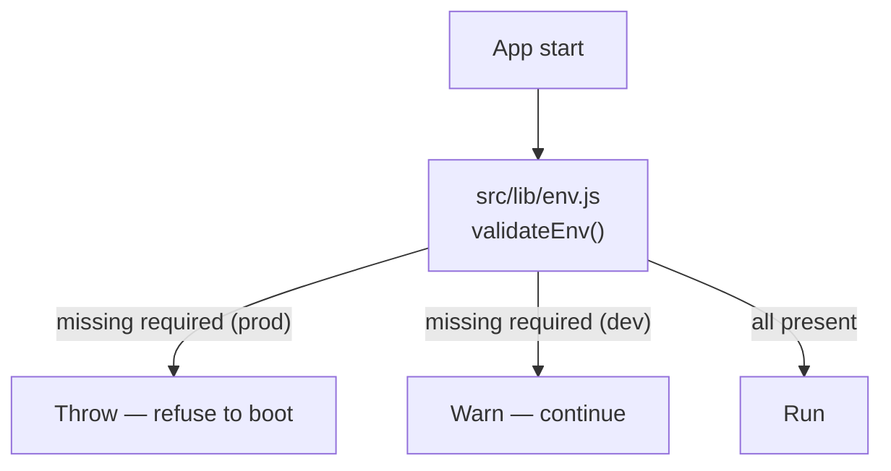

# Configuration (Environment Variable Reference)

> **Status:** Current — the authoritative list of every environment variable The-Lab reads.
> **Audience:** Developers configuring `.env.local` and operators configuring Vercel / the `vps/` tier.  ·  **Last reviewed:** 2026-05-29

## Overview

The-Lab is configured entirely through environment variables — there is no committed config file with live values. This document is the reference for **every** `process.env.*` the app and the `vps/` tier read, grouped by area, with each variable's purpose, whether it is required, where it is used, and whether it is a secret.

The variable set was derived by scanning `process.env.` across `src/`, `vps/`, `auth.js`, `auth.config.js`, `next.config.mjs`, and `jest.setup.js`. For local setup steps see <a href="local-development.md">Local Development</a>; for where each value is set in each environment see <a href="deployment.md">Deployment</a>.

## Fail-fast & no-fallback policy

**Security:** secrets and infrastructure endpoints have **no hardcoded fallbacks** in code (`CLAUDE.md` §5; `docs/audit/06-security-standards.md` §4). A subset is validated at startup by `src/lib/env.js` (`REQUIRED_ENV`): in **production** the server throws and refuses to boot if any is missing; outside production it warns and continues so local dev tolerates absent optional integrations. The startup-required set is:

`MONGODB_URI`, `AUTH_SECRET`, `JWT_SECRET`, `ENCRYPTION_KEY` (must be exactly **32 bytes**), `INTERNAL_API_SECRET`, `SQUARE_ACCESS_TOKEN`, `SQUARE_WEBHOOK_SIGNATURE_KEY`.

Variables outside that set are "required" only for the feature that uses them — the app boots without them but the dependent feature fails or no-ops (often logging a warning). Those are marked **Feature** below.

**Warning:** never use production data or production secrets in dev/staging (`CLAUDE.md` §8). Generate fresh values per environment.



## Core / database

| Variable | Purpose | Status | Used in | Secret |
|---|---|---|---|---|
| `MONGODB_URI` | MongoDB connection string. | **Required** (startup) | `src/lib/database.js`, `src/lib/env.js`, `jest.setup.js` | Yes |
| `MONGODB_NAME` | Database name. Defaults to `FabLab-Local`. | Optional | `src/lib/database.js` | No |
| `NODE_ENV` | Environment mode; drives strict env validation and disables PWA in dev. | Optional (set by platform) | `src/lib/env.js`, `next.config.mjs` | No |
| `NEXT_RUNTIME` | Next-set runtime marker (e.g. instrumentation hooks). | Optional (set by Next) | instrumentation | No |
| `PORT` | Listen port (used by the `vps/` orchestrator; web app uses Next defaults). | Optional | `vps/orchestrator/index.js`, `vps/docker-compose.yml` | No |

## Authentication & session

| Variable | Purpose | Status | Used in | Secret |
|---|---|---|---|---|
| `AUTH_SECRET` | next-auth v5 session/JWT secret. | **Required** (startup) | `auth.js`, `src/lib/env.js` | Yes |
| `JWT_SECRET` | App JWT signing secret. | **Required** (startup) | `auth.js`/auth service, `src/lib/env.js` | Yes |
| `ENCRYPTION_KEY` | PII field-encryption key; **must be exactly 32 bytes**. | **Required** (startup) | `src/app/api/v1/users/class.js`, `src/lib/env.js` | Yes |
| `NEXTAUTH_URL` | Canonical site URL for next-auth callbacks. | Feature | `auth.config.js` / auth | No |
| `ADMIN_EMAIL` | Bootstrap/admin email used in auth logic. | Feature | auth, register | No (PII-adjacent) |

## Square (payments & webhooks)

| Variable | Purpose | Status | Used in | Secret |
|---|---|---|---|---|
| `SQUARE_ACCESS_TOKEN` | Square API access token. | **Required** (startup) | `src/lib/square.js`, `src/lib/env.js` | Yes |
| `SQUARE_WEBHOOK_SIGNATURE_KEY` | Square webhook signing key (constant-time signature verification; fails closed if unset). | **Required** (startup) | `src/lib/squareSignature.js`, `src/lib/env.js` | Yes |
| `SQUARE_ENVIRONMENT` | Square environment (`sandbox` / `production`). | Feature | `src/lib/square.js`, `src/app/actions/actions.js`, square subscriptions service | No |
| `SQUARE_LOCATION_ID` | Square location for checkout/orders/subscriptions. | Feature | memberships/donations/sponsorship checkout, admin square routes | No |
| `NEXT_PUBLIC_SQUARE_APP_ID` | Square Web Payments SDK app id (client-side). | Feature | client checkout components | No (public) |
| `NEXT_PUBLIC_SQUARE_LOCATION_ID` | Square location id exposed to the browser SDK. | Feature | client checkout components | No (public) |

## AWS / S3 (uploads)

| Variable | Purpose | Status | Used in | Secret |
|---|---|---|---|---|
| `S3_ACCESS_KEY` | S3 access key id. | Feature | `src/utils/s3.util.js`, upload route | Yes |
| `S3_SECRET_KEY` | S3 secret access key. | Feature | `src/utils/s3.util.js`, upload route | Yes |
| `S3_ENDPOINT` | S3-compatible endpoint URL (also added to the image-proxy host allowlist). | Feature | `src/app/api/v1/upload/route.js`, `src/app/api/image-proxy/route.js` | No |
| `S3_BUCKET_NAME` | Target bucket. Badge generation defaults to `fablab-bounties` if unset. | Feature | upload route, `v1/holodeck/generate-badge-images` | No |
| `S3_REGION` | S3 region; defaults to `us-east-1`. | Optional | upload route, badge generation | No |

## Discord

| Variable | Purpose | Status | Used in | Secret |
|---|---|---|---|---|
| `DISCORD_CLIENT_ID` | Discord OAuth client id. | Feature | `auth.config.js` / auth | No |
| `DISCORD_CLIENT_SECRET` | Discord OAuth client secret. | Feature | `auth.config.js` / auth | Yes |
| `DISCORD_BOT_TOKEN` | Bot token for Discord API calls (role sync, DMs). | Feature | `src/lib/discord.js` | Yes |
| `DISCORD_PUBLIC_KEY` | Verifies inbound Discord interaction signatures. | Feature | `src/app/api/discord/interactions/route.js` | No (verification key) |
| `DISCORD_GUILD_ID` | Target Discord server/guild id. | Feature | `src/lib/discord.js` | No |
| `DISCORD_BOUNTY_CHANNEL_ID` | Channel for bounty announcements. | Feature | `src/app/api/v1/bounties/service.js` | No |

## Google / reCAPTCHA / Gemini

| Variable | Purpose | Status | Used in | Secret |
|---|---|---|---|---|
| `GOOGLE_CLIENT_ID` | Google OAuth client id. | Feature | `auth.config.js` / auth | No |
| `GOOGLE_CLIENT_SECRET` | Google OAuth client secret. | Feature | `auth.config.js` / auth | Yes |
| `RECAPTCHA_SECRET_KEY` | Server-side reCAPTCHA verification on registration. | Feature | `src/app/api/auth/register/route.js` | Yes |
| `NEXT_PUBLIC_RECAPTCHA_SITE_KEY` | reCAPTCHA site key (client-side widget). | Feature | register UI | No (public) |
| `GEMINI_API_KEY` | Google Gemini (`@google/genai`) badge image generation. | Feature | `v1/holodeck/generate-badge-images`, `v1/holodeck/ghost` | Yes |

## IoT / access-control tier

These connect the web app to the self-hosted `vps/` socket-server and orchestrator, and configure the device tier itself. See <a href="deployment.md">Deployment</a> and the <a href="../architecture/overview.md">Architecture Overview</a>.

| Variable | Purpose | Status | Used in | Secret |
|---|---|---|---|---|
| `INTERNAL_API_SECRET` | Bearer secret for internal/IoT control endpoints (e.g. door check-access); fails closed if unset. | **Required** (startup) | `src/app/api/internal/check-access/route.js`, `register-card`, `src/lib/env.js` | Yes |
| `WS_SERVER_URL` | URL of the socket-server for card-pairing / unlock calls. | Feature | `src/app/api/admin/pair-card/route.js`, `v1/memberships/pair-key/route.js` | No |
| `ACCESS_CONTROL_API_URL` | Access-control service base URL. | Feature | `src/lib/access-control.js` | No |
| `SOCKET_API_SECRET` | Shared secret authenticating app→socket-server control calls. | Feature | `vps/lib/apiAuth.js`, socket-server | Yes |
| `DEVICE_SECRETS` | Per-device secrets the socket-server uses to authenticate hardware. | Feature | `vps/lib/deviceAuth.js`, `vps/socket-server.js` | Yes |
| `ORCHESTRATOR_URL` | URL of the CTF orchestrator API. | Feature | `src/services/orchestrator.js` | No |
| `ORCHESTRATOR_SECRET` | Bearer secret for orchestrator calls; `vps/docker-compose.yml` requires it (no default). | Feature | `src/services/orchestrator.js`, `vps/orchestrator/lib/auth.js` | Yes |
| `DOMAIN` | Base domain for mission container routing; orchestrator defaults to `localhost`. | Feature | `vps/orchestrator/index.js`, `vps/docker-compose.yml` | No |

## Email (nodemailer)

| Variable | Purpose | Status | Used in | Secret |
|---|---|---|---|---|
| `EMAIL_USER` | SMTP account / sender address. | Feature | `src/app/utils/email.util.js` | No (PII-adjacent) |
| `EMAIL_PASS` | SMTP password / app password. | Feature | `src/app/utils/email.util.js` | Yes |

## Misc / `NEXT_PUBLIC_*` (client-exposed) & other

`NEXT_PUBLIC_*` variables are inlined into the client bundle — **never put secrets in them.**

| Variable | Purpose | Status | Used in | Secret |
|---|---|---|---|---|
| `NEXT_PUBLIC_APP_URL` | Public app URL (checkout redirects, webhook self-registration). | Feature | memberships checkout/confirm, `src/lib/squareWebhook.js`; defaulted in `jest.setup.js` | No (public) |
| `NEXT_PUBLIC_URL` | Public URL fallback used alongside `NEXT_PUBLIC_APP_URL`. | Feature | memberships checkout/confirm, `src/lib/squareWebhook.js`; defaulted in `jest.setup.js` | No (public) |
| `NEXT_PUBLIC_BASE_URL` | Public base URL for client-side requests. | Feature | client code | No (public) |
| `NEXT_PUBLIC_BUILD_HASH` | Build identifier surfaced to the client. | Optional | client code | No (public) |
| `APP_URL` | Server-side app URL. | Feature | auth/server code | No |
| `IMAGE_PROXY_ALLOWED_HOSTS` | Extra allowlisted hosts for the SSRF-guarded image proxy. | Feature | `src/app/api/image-proxy/route.js` | No |
| `WIFI_SSID` | Lab Wi-Fi SSID surfaced via a Discord interaction. | Feature | `src/app/api/discord/interactions/route.js` | No |
| `WIFI_PASSWORD` | Lab Wi-Fi password surfaced via a Discord interaction. | Feature | `src/app/api/discord/interactions/route.js` | Yes |

## Examples

Minimal `.env.local` to boot the web app locally (see <a href="local-development.md">Local Development</a>):

```bash
MONGODB_URI="mongodb://127.0.0.1:27017"
MONGODB_NAME="FabLab-Local"
AUTH_SECRET="<random>"
JWT_SECRET="<random>"
ENCRYPTION_KEY="<exactly-32-bytes>"
INTERNAL_API_SECRET="<random>"
SQUARE_ACCESS_TOKEN="<sandbox-token>"
SQUARE_WEBHOOK_SIGNATURE_KEY="<webhook-key>"
```

## Related documents

- <a href="local-development.md">Local Development</a> — using these in `.env.local`.
- <a href="deployment.md">Deployment</a> — where each value is set per environment.
- <a href="../architecture/overview.md">Architecture Overview</a> — how the integrations fit together.

## Changelog
| Date | Change | Author |
|------|--------|--------|
| 2026-05-29 | Initial version | app dev |
