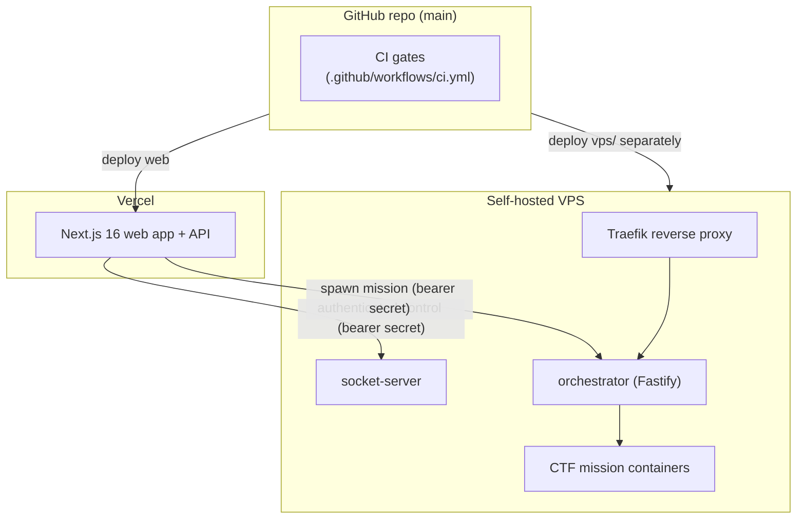

# Deployment

> **Status:** Current — how the web app and the IoT tier ship.
> **Audience:** Operators and developers releasing The-Lab.  ·  **Last reviewed:** 2026-05-29

## Overview

The-Lab deploys as **two independent tiers**:

1. The **web app + API** (the Next.js 16 application) to **Vercel**.
2. The **`vps/` IoT/CTF tier** (socket-server + orchestrator + Docker/Traefik) to a self-hosted VPS.

They are released separately and share only the bearer secrets that authenticate the web app's calls into the device tier. This guide covers each tier's deploy path, the configuration each needs, and the CI gates a change passes before merge. All changes reach `main` through a pull request (`CLAUDE.md` §6); production deploys require the merged PR plus approval and keep a rollback plan — reverting the squashed PR (`CLAUDE.md` §8).



## Prerequisites

- A **Vercel** project linked to the repo with the environment variables from <a href="configuration.md">Configuration</a> set per environment (dev / preview / production).
- For the device tier: a VPS (Ubuntu/Debian) with **Docker** and **Docker Compose**, and DNS records pointing at it (`vps/README.md`).
- **Security:** separate dev / staging / production environments; never use production data or secrets outside production (`CLAUDE.md` §8). Required secrets are validated at startup (`src/lib/env.js`) with no hardcoded fallbacks.

## Web app — Vercel

The Next.js app deploys to Vercel as a standard App Router project.

### What ships

`.vercelignore` controls what is excluded from the Vercel deployment. **Note:** in this repo `.vercelignore` is currently **empty**, so nothing is excluded by it today. The intent (per the <a href="../architecture/overview.md">Architecture Overview</a> and `CLAUDE.md`) is for the deployment to exclude the self-hosted `vps/` tier and operational `scripts/` — keep that exclusion in mind when populating `.vercelignore`, since the `vps/` tier is deployed separately and should not be part of the Vercel build/runtime.

### Configuration

Set the variables from <a href="configuration.md">Configuration</a> in the Vercel project. The startup-required set (`MONGODB_URI`, `AUTH_SECRET`, `JWT_SECRET`, `ENCRYPTION_KEY` — exactly 32 bytes, `INTERNAL_API_SECRET`, `SQUARE_ACCESS_TOKEN`, `SQUARE_WEBHOOK_SIGNATURE_KEY`) **must** be present in production or the app refuses to boot (`src/lib/env.js`). The variables linking the app to the device tier (`WS_SERVER_URL`, `ACCESS_CONTROL_API_URL`, `ORCHESTRATOR_URL`, `ORCHESTRATOR_SECRET`, `INTERNAL_API_SECRET`) must match the device tier's configuration.

### Build & transport hardening

- Build is `next build`; the PWA layer (`next-pwa`) is active in production (disabled in dev). Verify lockfile integrity and bake **no** secrets into the client bundle — only `NEXT_PUBLIC_*` values are client-exposed (`CLAUDE.md` §8).
- Transport/security headers are set in `next.config.mjs`: `Strict-Transport-Security` (HSTS, preload), `X-Content-Type-Options`, `X-Frame-Options`, `Referrer-Policy`, `Permissions-Policy`, `X-DNS-Prefetch-Control`. The **Content-Security-Policy ships Report-Only** (`Content-Security-Policy-Report-Only`) and must be validated against staging before being promoted to the enforcing header.

## IoT / CTF tier — self-hosted VPS

The `vps/` tier runs on the makerspace's own server, fronted by Traefik, and is deployed independently of Vercel.

### Components

- **`vps/socket-server.js`** — controls door/equipment hardware over WebSockets. The app's authenticated control calls (bearer secret, `vps/lib/apiAuth.js`) unlock doors and pair cards; device hardware authenticates with per-device secrets (`vps/lib/deviceAuth.js`, `DEVICE_SECRETS`). Decisions are audit-logged.
- **`vps/orchestrator/`** — a Fastify API (`vps/orchestrator/index.js`) that spawns per-user Docker containers for "Hack the Lab" missions, behind Traefik. Untrusted identifiers are allowlist-sanitized before reaching container/volume/image names or Traefik rules (`vps/orchestrator/lib/sanitize.js`).
- **Traefik** — reverse proxy routing to the orchestrator and dynamic mission containers (`vps/docker-compose.yml`).

### Deploy steps

Per `vps/README.md`, copy the tier to the host and bring it up with Docker Compose:

```bash
scp -r vps/docker-compose.yml user@host:~/vps/
scp -r vps/orchestrator      user@host:~/vps/
scp -r vps/missions          user@host:~/vps/

ssh user@host
cd ~/vps
docker build -t mission-01 ./missions/mission-01   # build mission image(s)
docker compose up -d --build
```

DNS records point a wildcard subdomain at the VPS so per-user mission containers get a routable host (`vps/README.md`).

### Configuration

- `ORCHESTRATOR_SECRET` is **required by `vps/docker-compose.yml` with no default** (the compose file errors if unset); it must match the `ORCHESTRATOR_SECRET` the web app uses.
- `DOMAIN` sets the base domain for mission routing (orchestrator defaults to `localhost`).
- `SOCKET_API_SECRET` and `DEVICE_SECRETS` configure the socket-server's app-side and device-side authentication.

**Warning:** `vps/docker-compose.yml` enables the Traefik dashboard insecurely (`--api.insecure=true`, bound to localhost) and leaves TLS resolvers commented out. Enable HTTPS/TLS before exposing the tier publicly (`CLAUDE.md` §5/§8).

## CI gates

Every PR into `main` runs `.github/workflows/ci.yml`. Gate enforcement is staged — some gates block merge today; others run report-only and flip to enforced as their backing remediations land.

| Gate | Job | Enforcement |
|---|---|---|
| Lint | `lint` (`npm run lint`) | **Enforced** |
| Unit/integration tests | `test` (`npm test`) | **Enforced** |
| Dependency review (new deps) | `dependency-review` (PRs only, `fail-on-severity: high`) | **Enforced** |
| Build | `build` (`npm run build`) | Report-only (`continue-on-error`) |
| Dependency CVE audit | `sca` (`npm audit --audit-level=high`) | Report-only |
| Secret scan | `secret-scan` (gitleaks) | Report-only until SEC-01 |
| SAST | `sast` (Semgrep) | Report-only until SEC-23/24 |

CI runs on **Node 20**. The report-only gates flip to enforced as their remediations complete (the workflow header tracks the mapping, e.g. secret-scan after SEC-01, SAST/crypto after SEC-23). CodeQL was removed because code scanning needs GitHub Advanced Security, unavailable on this repo's plan. Additional gates noted in `CLAUDE.md` §7 (e2e, headers-check, response-shape, container-iac-scan, license-check) are stubs implemented as remediation builds them out.

## Release & rollback

- Deploys to production require the merged PR + approval (`CLAUDE.md` §8); squash-merge keeps each PR a single revertable unit.
- **Rollback** = revert the squashed PR and redeploy.
- Config hardening (TLS, HSTS, headers, encryption at rest) is verified in **staging** before promotion (`CLAUDE.md` §8). Seed/migration/test endpoints must not be reachable in production (gated by `src/lib/adminGuard.js`).

## Related documents

- <a href="configuration.md">Configuration</a> — every variable each tier needs.
- <a href="local-development.md">Local Development</a> — running locally before you ship.
- <a href="testing.md">Testing</a> — the suite the CI gates run.
- <a href="../architecture/overview.md">Architecture Overview</a> — deployment topology in context.

## Changelog
| Date | Change | Author |
|------|--------|--------|
| 2026-05-29 | Initial version | app dev |
