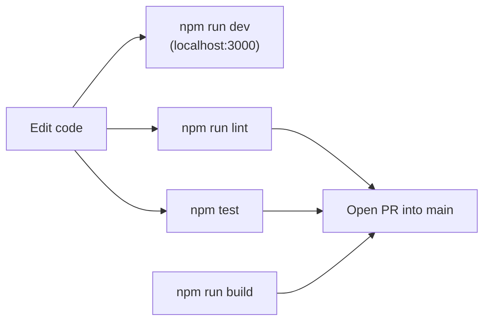

# Local Development

> **Status:** Current — the canonical "clone to running" setup for The-Lab.
> **Audience:** Developers and contributors setting up the app locally.  ·  **Last reviewed:** 2026-05-29

## Overview

This guide takes you from a fresh clone to a running development server, a passing test suite, and a production build. The-Lab is a single **Next.js 16** (App Router, JavaScript) application backed by **MongoDB**; the separate `vps/` IoT/CTF tier is deployed independently and is **not** required to run the web app locally (see <a href="deployment.md">Deployment</a>).

After this guide you should be able to run `npm run dev`, `npm test`, and `npm run build` against a local checkout. For the engineering and secure-SDLC rules that govern any change you make, read <a href="../../CLAUDE.md">CLAUDE.md</a> first.

## Prerequisites

- **Node.js 20.x** — the CI runners pin Node 20 (`.github/workflows/ci.yml`). Match it locally to avoid surprises.
- **npm** — this repo uses `package-lock.json`; use `npm`, not yarn/pnpm/bun.
- **MongoDB** — a connection string for a local or hosted dev database. Options:
  - a local `mongod` (e.g. `mongodb://127.0.0.1:27017`), or
  - a hosted dev cluster (Atlas) you control.
  - **Security:** never point local dev at a production database or use production secrets (`CLAUDE.md` §8). Seed synthetic data instead.
- Optional integration credentials (Square, S3, Discord, Google) — only needed to exercise those features locally. See <a href="configuration.md">Configuration</a>.

**Note:** The app targets **Next.js 16** with **React 19**. `next lint` was removed in Next 16, so linting runs through ESLint directly (`eslint .`). The PWA layer (`next-pwa`) is disabled in development (`next.config.mjs`, `disable: process.env.NODE_ENV === "development"`).

## Setup

### 1. Clone and install

```bash
git clone <repo-url> the-lab
cd the-lab
npm ci   # clean, lockfile-exact install (preferred over `npm install`)
```

`npm ci` installs exactly what `package-lock.json` pins — the same set CI uses.

### 2. Create `.env.local`

Next.js loads `.env.local` automatically in development; it is git-ignored. Create one in the repo root with at least the required variables the app validates at startup:

```bash
# Minimum to boot — see docs/guides/configuration.md for the FULL reference.
MONGODB_URI="mongodb://127.0.0.1:27017"
MONGODB_NAME="FabLab-Local"          # optional; defaults to "FabLab-Local"
AUTH_SECRET="<random 32+ char string>"
JWT_SECRET="<random string>"
ENCRYPTION_KEY="<exactly 32 bytes>"  # validated to be 32 bytes
INTERNAL_API_SECRET="<random string>"
SQUARE_ACCESS_TOKEN="<square sandbox token>"
SQUARE_WEBHOOK_SIGNATURE_KEY="<square webhook key>"
```

The required set is enforced by `src/lib/env.js` (`REQUIRED_ENV`): `MONGODB_URI`, `AUTH_SECRET`, `JWT_SECRET`, `ENCRYPTION_KEY` (must be exactly 32 bytes), `INTERNAL_API_SECRET`, `SQUARE_ACCESS_TOKEN`, and `SQUARE_WEBHOOK_SIGNATURE_KEY`. In production the app refuses to boot if any are missing; outside production it warns and continues, so missing optional integrations only break the features that use them.

**Security:** secrets have **no hardcoded fallbacks** — the app fails fast rather than running with a default (`CLAUDE.md` §5). Generate fresh random values for local use; do not reuse production keys. For every variable (purpose, required/optional, secret-or-not), see the full table in <a href="configuration.md">Configuration</a>.

### 3. Run the development server

```bash
npm run dev
```

This starts Next on [http://localhost:3000](http://localhost:3000). The database connection is established lazily on first query — `src/lib/database.js` constructs the `MongoClient` only inside `connect()`, so importing modules has no side effects and a missing/wrong `MONGODB_URI` only surfaces when a route actually hits the DB (you'll see `✅ MongoDB Connected` / `Using Database: …` in the console on first connect).

## Everyday workflow



### Available scripts

All scripts are defined in `package.json`:

| Command | What it does |
|---|---|
| `npm run dev` | Start the Next dev server on port 3000. |
| `npm run build` | Production build (`next build`). |
| `npm start` | Serve a built app (`next start`). |
| `npm run lint` | ESLint over the repo (`eslint .`). |
| `npm run lint:fix` | ESLint with `--fix`. |
| `npm test` | Run the Jest suite (`jest`). |
| `npm run test:watch` | Jest in watch mode. |
| `npm run test:ci` | CI mode — `jest --ci --runInBand --forceExit`. |

### Run the tests

```bash
npm test
```

DB-backed end-to-end tests spin up an in-memory MongoDB (`mongodb-memory-server`), so they don't need a running `mongod`. The first run may download a MongoDB binary (the Jest `testTimeout` is set to 60s to allow for it). See <a href="testing.md">Testing</a> for the layout and conventions.

### Lint and build before opening a PR

```bash
npm run lint
npm run build
```

`lint` and `test` are the **enforced** CI gates and must pass before merge; `build` runs report-only in CI but is worth running locally to catch breakage early (<a href="deployment.md">Deployment</a>). All changes land via a pull request into `main` — never commit directly (`CLAUDE.md` §6).

## Troubleshooting

- **App won't boot / env validation throws** — a required variable from `src/lib/env.js` is missing or `ENCRYPTION_KEY` isn't exactly 32 bytes. Fix `.env.local`.
- **`MONGODB_URI is not set`** — `src/lib/database.js` throws this on first DB use; set `MONGODB_URI` in `.env.local`.
- **A feature errors only at runtime** — its integration credential (Square/S3/Discord/Google) is unset. Local dev tolerates missing optional vars; supply the relevant ones from <a href="configuration.md">Configuration</a>.
- **First test run is slow** — `mongodb-memory-server` is downloading its binary; subsequent runs are cached.

## Related documents

- <a href="configuration.md">Configuration</a> — the full environment-variable reference.
- <a href="testing.md">Testing</a> — test layout, the Jest harness, and CI gates.
- <a href="deployment.md">Deployment</a> — Vercel (web app) and the `vps/` IoT tier.
- <a href="../architecture/overview.md">Architecture Overview</a> — system shape and the layered API pattern.

## Changelog
| Date | Change | Author |
|------|--------|--------|
| 2026-05-29 | Initial version | app dev |
