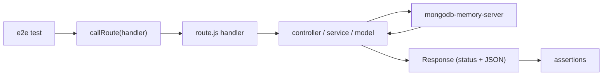

# Testing

> **Status:** Current — how the test suite is laid out, runs, and gates merges.
> **Audience:** Developers and reviewers writing or reading tests.  ·  **Last reviewed:** 2026-05-29

## Overview

The-Lab tests with **Jest** (`jest@30`) wired through `next/jest`. Tests are split into fast **unit** tests and DB-backed **end-to-end (e2e)** tests that drive real App Router route handlers — and, where a feature touches Mongo, a real in-memory MongoDB via `mongodb-memory-server`. This guide covers the layout, the harness helpers, the auth-mock pattern, how to write a finding-named regression test, and the CI gates.

Two CLAUDE.md rules drive most of what's here: every touched/refactored file gets a **full request→logic→datastore→response** e2e test (§6), and every bug fix / security remediation ships a **finding-named regression test** that fails on the old code and passes on the fix (§6, §7).

## Prerequisites

- A local checkout with `npm ci` complete (see <a href="local-development.md">Local Development</a>).
- No running MongoDB is required — DB-backed tests start their own in-memory server. The first run may download a MongoDB binary (the Jest `testTimeout` is 60s to allow for it).

## Running tests

| Command | What it does |
|---|---|
| `npm test` | Run the whole suite (`jest`). |
| `npm run test:watch` | Watch mode for local iteration. |
| `npm run test:ci` | CI mode — `jest --ci --runInBand --forceExit`. |

Run a single file or pattern:

```bash
npm test -- test/e2e/check-access.test.js
npm test -- -t "SEC-04"
```

## Test layout

Tests live under `test/`, matched by `testMatch: ["**/test/**/*.test.js"]` (`jest.config.mjs`):

- **`test/unit/`** — pure/edge logic with dependencies mocked: crypto and signature checks (`auth-crypto.test.js`, `squareSignature.test.js`, `secureCompare.test.js`), env validation (`env.test.js`), Mongo sanitization (`mongo-sanitize.test.js`), the lazy DB singleton (`database-lazy.test.js`), `vps/` auth (`apiAuth.test.js`, `deviceAuth.test.js`, `orchestratorAuth.test.js`), security headers (`security-headers.test.js`), dependency-version sentinels, and finding sentinels (e.g. `sec-01-no-db-cred.test.js`, `sec-24-no-log-leaks.test.js`).
- **`test/e2e/`** — route handlers exercised over a real `Request`/`Response` boundary, with MongoDB-backed flows where relevant: `check-access.test.js`, `pair-card.test.js`, `register-card.test.js`, `square-webhook.test.js`, `access-unlock-audit.test.js`, `image-proxy-ssrf.test.js`, `notifications-idor.test.js`, `seed-migration-auth.test.js`, `upload-hardening.test.js`, `users-api-authz.test.js`, `db.smoke.test.js`.
- **`test/helpers/`** — shared harness: `mongo.js` (in-memory MongoDB) and `route.js` (invoke a route handler end-to-end).

## The Jest harness

`jest.config.mjs` builds the config through `next/jest` (SWC transform + Next env handling):

- `testEnvironment: "node"` — server-side code, no jsdom.
- `setupFilesAfterEnv: ["<rootDir>/jest.setup.js"]` — runs `jest.setup.js` before each test file.
- `clearMocks: true` — mock state is reset between tests.
- `moduleNameMapper` maps the `@/` alias to `src/` first, then the repo root — so `@/auth` resolves to the root-level `auth.js`.

`jest.setup.js` sets dummy env (`MONGODB_URI`, `MONGODB_NAME`, `NEXT_PUBLIC_URL`, `NEXT_PUBLIC_APP_URL`) using `||=`, so modules that read env at import time don't crash when a test only exercises pre-DB logic. DB-backed tests **override** `MONGODB_URI` via the in-memory helper.

### Driving a route end-to-end

`test/helpers/route.js` exports `callRoute(handler, opts)`, which constructs a real `Request`, calls the exported handler (`GET`/`POST`/…), and returns `{ status, json, text, headers }`. This exercises the genuine HTTP edge — the same path Next runs in production. Some e2e tests construct the `Request` inline instead (e.g. `check-access.test.js`); both styles hit the real handler.

### DB-backed e2e with an in-memory MongoDB

`test/helpers/mongo.js` provides `startMemoryMongo()` / `stopMemoryMongo()`:

```js
import { startMemoryMongo, stopMemoryMongo } from "../helpers/mongo";

beforeAll(async () => { await startMemoryMongo(); });  // sets MONGODB_URI to the ephemeral server
afterAll(async () => { await stopMemoryMongo(); });
```

`startMemoryMongo()` boots `MongoMemoryServer` and points `process.env.MONGODB_URI` at it. **Import app modules that touch the DB *after* calling it** so the lazy `src/lib/database.js` singleton connects to the memory server, not the dummy URI from `jest.setup.js`.



### The `jest.mock("@/auth")` pattern

To test the authn/authz edge without a real session, e2e tests mock the next-auth `auth()` resolver and the feature's service, then set the session per case:

```js
jest.mock("@/auth", () => ({ auth: jest.fn() }));
jest.mock("@/app/api/v1/users/service", () => ({ __esModule: true, default: { /* mocked methods */ } }));

import { auth } from "@/auth";
import UserController from "@/app/api/v1/users/controller";

const ANON  = null;
const USER  = { user: { userID: "user-self", role: "user" } };
const ADMIN = { user: { userID: "admin-1", role: "admin" } };

beforeEach(() => jest.clearAllMocks());

test("anonymous request is rejected", async () => {
  auth.mockResolvedValue(ANON);   // drive the session
  // …call the controller and assert 401
});
```

This is how `test/e2e/users-api-authz.test.js` and `test/e2e/notifications-idor.test.js` assert the abuse cases (anonymous → 401, ownership binding, role checks) with the auth and service layers mocked so the test isolates the HTTP/authz edge.

## Writing a finding-named regression test

Every bug fix / security remediation ships a regression test that **names the finding** (e.g. `SEC-04`) so it can never silently return — it must **fail against the old (vulnerable) code** and **pass after the fix** (`CLAUDE.md` §6/§7).

- **Name the finding** in the `describe`/`test` title and a header comment explaining the vulnerability and why the test fails pre-fix. Example — `test/e2e/check-access.test.js` covers **SEC-04**: the IoT access endpoint must require a configured `INTERNAL_API_SECRET` (no fallback), returns `500` when it's unset (fail closed), `401` for the old leaked fallback value or a wrong token, and `400` for a valid token with a missing `cardId`.
- **Sentinels** are a valid regression style for "must never reappear" findings: `test/unit/sec-01-no-db-cred.test.js` walks the tree and fails if the leaked credential or its debug scripts return, explicitly scoping out CTF game content and audit docs (`CLAUDE.md` §14).
- Exercise the **real abuse case** from the threat model — anonymous → 401, tampered amount rejected, forged webhook rejected (`square-webhook.test.js`), IDOR blocked (`notifications-idor.test.js`), SSRF blocked (`image-proxy-ssrf.test.js`).

## CI gates

`npm test` is an **enforced** gate on every PR into `main` (`.github/workflows/ci.yml`, job `test`, `npm test -- --passWithNoTests`), alongside enforced `lint`. The remaining gates (build, `npm audit`, gitleaks secret-scan, Semgrep SAST) run **report-only** and flip to enforced as their remediations land. See <a href="deployment.md">Deployment</a> for the full gate table. No remediation merges without its finding-named regression test (`CLAUDE.md` §6).

## Related documents

- <a href="local-development.md">Local Development</a> — install and run the suite.
- <a href="deployment.md">Deployment</a> — the CI gate enforcement matrix.
- <a href="../architecture/overview.md">Architecture Overview</a> — the layered request path tests exercise.

## Changelog
| Date | Change | Author |
|------|--------|--------|
| 2026-05-29 | Initial version | app dev |
