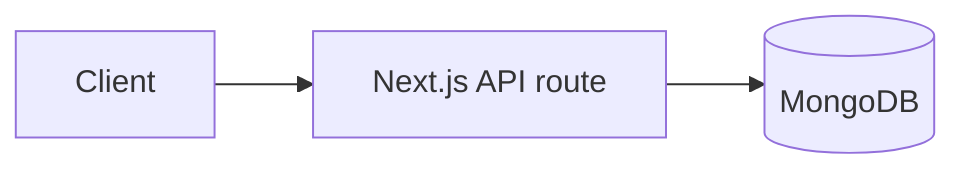

<!--
  The-Lab documentation template. Copy this file to start a new document.
  Every doc under docs/ follows this structure so the set reads consistently.

  Conventions (the house style):
  • Frontmatter: fill every field. `status` ∈ draft | review | current | deprecated | archived.
    `last_reviewed` is an absolute date (YYYY-MM-DD). `owners` is a role/team, not a person.
  • One H1 only (the title). Sections use H2/H3. Keep heading text short and noun-led.
  • Audience-first: state who the doc is for and what they need before the detail.
  • Voice: present tense, active voice, second person ("you") for guides. Be precise; prefer
    short sentences. Define an acronym on first use.
  • Code/paths: wrap file paths, commands, env vars, and identifiers in `backticks`. Use
    fenced blocks with a language (```bash, ```js, ```json). Reference source as
    `path/to/file.js:line` (clickable).
  • Diagrams: use Mermaid (```mermaid) so they render on GitHub and stay in version control.
  • Admonitions: use a bold lead-in — **Note:**, **Warning:**, **Security:** — not HTML blocks.
  • LINKS — use HTML anchors for internal cross-references (mixed HTML+Markdown is fine and
    renders on GitHub): <a href="../relative/path.md">Title</a>. This keeps doc-to-doc links
    reliably clickable. External URLs may use Markdown [text](https://…) form.
  • Don't paste secrets, tokens, real PII, or live credentials into docs.
  • CTF "Hack the Lab" content (docs/game/, holodeck/arcade/terminal/missions) is intentional
    game material — document it as such; never present its planted vulns as real defects.
-->
---
title: <Document Title>
status: draft            # draft | review | current | deprecated | archived
audience: <e.g. developers | operators | contributors | reviewers>
owners: <role/team, e.g. SEC, app dev, OPS>
last_reviewed: <YYYY-MM-DD>
related:
  - <relative/path/to/related-doc.md>
---

# <Document Title>

> **Status:** <one line — what state this doc is in and any caveat.>
> **Audience:** <who this is for.>  ·  **Last reviewed:** <YYYY-MM-DD>

## Overview
<1–3 paragraphs: what this document covers and why it exists. The reader should
know after this section whether they're in the right place.>

## Prerequisites
<What the reader needs first — accounts, access, tools, or other docs to read.
Omit the section if there are none.>

## <Body section 1>
<The substance. Use H2 per major topic, H3 for sub-topics. Lead with the
high-level model, then detail. Include a Mermaid diagram where a picture helps.>



## <Body section 2>
<...>

## Examples
<Concrete, copy-pasteable examples (requests, commands, config). Show inputs and
expected outputs. Omit if not applicable.>

## Related documents
- <a href="../relative/path.md">Title</a> — why it's relevant

## Changelog
| Date | Change | Author |
|------|--------|--------|
| <YYYY-MM-DD> | Initial version | <role> |
