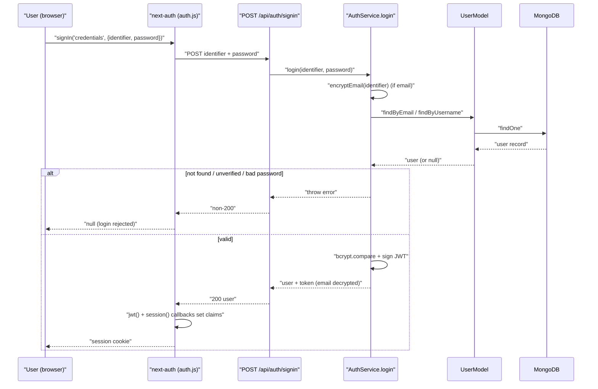

# Authentication & Authorization

> **Status:** Current — describes the next-auth v5 session model, the three providers, and the server-side authorization policy.
> **Audience:** Engineers building authenticated endpoints and reviewers checking access control.  ·  **Last reviewed:** 2026-05-29

## Overview

Authentication is built on **next-auth v5** with **JWT sessions** (no server session store). Three providers are wired up: **Google** and **Discord** (OAuth) and **Credentials** (email/username + bcrypt password). The framework is configured at the repo root in `auth.js` and `auth.config.js` (next-auth's required locations), and exposes `auth()`, `signIn`, `signOut`, and route `handlers`.

Authorization is **server-side and explicit**. Because `/api/*` is **not** covered by middleware, each route resolves the session with `auth()` at the edge and enforces role/ownership before doing work. Identity always comes from the session token — never from a client-supplied `userID` or body field. This document covers the session model, each provider, the at-the-edge pattern, the user-API access policy (`access.js`), and the operational-endpoint guard (`adminGuard.js`).

## Session model

`auth.config.js` sets `session.strategy: 'jwt'` with `maxAge` 30 days and `updateAge` 24 hours, and `secret: process.env.AUTH_SECRET`. The sign-in page is `/auth/signin`. The `authorized` callback gates the `/dashboard` page tree (logged-in users only); it does **not** protect `/api/*` — API routes protect themselves.

The JWT and session are shaped in `auth.js` callbacks:

- **`jwt({ token, user })`** — on sign-in, copies `userID`, `name`, `firstName`, `lastName`, `username`, `role`, `image`, `discordId` onto the token. It also handles an account-**merge** scenario (incoming user differs from the token's user → `UsersService.mergeUsers`), records `lastLogin`, and enforces **grace-period expiry**: if `membership.gracePeriodStartedAt` is older than 7 days and the member isn't waived, it suspends access (`membership.status = 'suspended'`, `accessKey.issued = false`).
- **`session({ session, token })`** — mirrors those token fields onto `session.user`, so server code reads `session.user.userID` and `session.user.role`.

The `signIn` callback additionally adds Discord users to the guild (`DiscordService.addMemberToGuild`) when an access token is present.

## Providers

### Credentials (email/username + password)

The `CredentialsProvider.authorize` in `auth.js` POSTs the identifier/password to `/api/auth/signin`, which runs `AuthService.login` (`src/app/api/auth/[...nextauth]/service.js`):

1. If the identifier contains `@`, encrypt it (`encryptEmail`) and look up by encrypted email (`UserModel.findByEmail`); otherwise look up by username.
2. Require `status === 'verified'` (else "verify your email" error).
3. Compare the password with `bcrypt.compare` against the stored hash.
4. On success, mint a JWT (`jsonwebtoken`, `userID` + `role`, `JWT_SECRET`) and return the user with a **decrypted** email.

### Google (OAuth)

`GoogleProvider` (env: `GOOGLE_CLIENT_ID`, `GOOGLE_CLIENT_SECRET`). Its `profile()` looks the user up by email, then falls back to `googleId` (`profile.sub`) so a changed email never creates a duplicate. New users are created via `AuthController.register`; existing users get backfilled provider/`googleId`/`image`. Registration through the public form additionally enforces a Cloudflare Turnstile captcha — see <a href="integrations.md">Integrations</a>.

### Discord (OAuth)

`DiscordProvider` (env: `DISCORD_CLIENT_ID`, `DISCORD_CLIENT_SECRET`; scope `identify email guilds.join`). Its `profile()`:

- Honors a **link-intent** cookie (`discord_link_for`, a signed JWT) so a logged-in user "connecting Discord" attaches it to their existing account instead of creating a ghost.
- Otherwise looks up by **encrypted** email then `discordId`, creating the account if new (with username-collision and email-conflict recovery that links Discord to the matching account).
- Claims any pending stake tips addressed to the Discord ID on first login.

## Authorization

### `auth()` at the edge

Controllers call `auth()` first, derive the `actor` (`{ userID, role }`) from the session, and pass it down to the service. A `null` actor means a trusted server-side caller (webhooks, Discord callback, membership/Square flows that import the service directly) and bypasses the client guards — untrusted input only enters through the controller, which always supplies an actor or returns 401. Reference implementations: `src/app/api/v1/bounties/*`, `src/app/api/v1/users/*`, `src/app/api/v1/admin/plans/route.js`.

### User access policy (`src/app/api/v1/users/access.js`)

This file is the single source of truth for the user API's access control:

- **`isAdmin(actor)`** — true only for `role === 'admin'` (the one privileged role).
- **Public-safe read projection** — `PUBLIC_USER_FIELDS` and `PUBLIC_MEMBERSHIP_FIELDS` define what an anonymous or non-owner reader may see. PII (`email`, `phoneNumber`), credentials (`password`), and integration IDs (`discordId`, `googleId`, `squareID`) are excluded. `toPublicUser()` applies the projection; `isPublicActiveMember()` decides whether a record is visible to non-owners at all.
- **`stripSensitive()`** — removes the `password` hash from any response, even to the owner/admin.
- **Self-update whitelist** — `SELF_WRITABLE_FIELDS` and `SELF_WRITABLE_MEMBERSHIP_FIELDS` bound what a non-admin may write to their **own** record. `sanitizeSelfUpdate()` drops non-whitelisted keys, drops `$`-prefixed/`_id` keys (Mongo-operator injection), and **rebuilds `membership` from the stored record** so access-granting fields (`role`, `status`, `accessKey`, `subscriptionStatus`, `isWaived`, …) cannot be forged. Volunteer-log entries submitted by a member are reconciled to `status: 'pending'` so hours can't be self-approved.

This closes the privilege-escalation path: a client cannot set `role`, flip `membership.status`, or grant itself an access key by POSTing those fields.

### Operational-endpoint guard (`src/lib/adminGuard.js`)

`guardOperationalEndpoint()` protects seed/migration/test endpoints that do bulk writes or hardware actions. It returns a short-circuit `NextResponse` (or `null` when allowed): 401 if unauthenticated, 403 if not `admin`. With `{ productionDisabled: true }` it **404s in production even for an admin** (dev/test-only handlers must be unreachable in production, per CLAUDE.md §8). Example consumer: the badge seed route.

## Secrets

Auth secrets are env-only with **no fallbacks**: `AUTH_SECRET` (next-auth), `JWT_SECRET` (the app's own JWTs in `users/class.js` and `AuthService`), `ENCRYPTION_KEY` (email/phone encryption). A missing required secret fails fast rather than defaulting. See <a href="../audit/06-security-standards.md">the security standards</a>.

## Related documents

- <a href="overview.md">Architecture Overview</a> — the layered request lifecycle and trust boundaries.
- <a href="data-model.md">Data model</a> — the `users` record, `role`, and `membership` shape.
- <a href="integrations.md">Integrations</a> — Google/Discord OAuth and Cloudflare Turnstile configuration.
- <a href="../migrations/sec-23-pii-encryption-gcm-blind-index.md">SEC-23 PII-encryption migration plan</a> — email/phone encryption hardening.

## Changelog
| Date | Change | Author |
|------|--------|--------|
| 2026-05-29 | Initial version | app dev |
