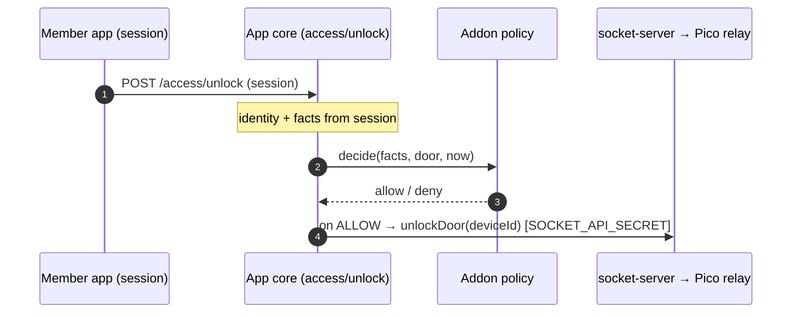

# Door Access Controller (addon)

> **Status:** Draft / scaffold — the pure policy engine + plugin wiring exist and are tested; the
> model, HTTP routes, admin UI, and offline-allowlist signer are the next slices (see
> [Migration](#migration-strangler-not-big-bang)).
> **Audience:** Engineers and operators on physical access control. Security-relevant (touches the
> `vps/` IoT tier + authorization) — SEC review required (`CLAUDE.md` §2/§6).

## Why this addon

Physical door access already works, but the logic is **scattered and hardcoded**: good-standing
rules live inline in `src/app/api/v1/access/unlock/route.js` and `src/app/api/internal/check-access/route.js`,
pairing in `admin/pair-card` + `memberships/pair-key`, and there is no configurable role/time policy.
This addon **consolidates** that into one policy-owning plugin and **adds** configurable
role × time × door × account policy, QR + app-triggered entry, and a signed **offline allowlist** for
availability — without changing the Pi Pico / Pi Zero firmware or the `vps/socket-server.js` control
contract.

## The one rule the design turns on

**The core owns identity; the addon owns policy.** The core app resolves membership **facts** (status,
role, subscription, waived, community) and **presents them per request**. The addon **never re-derives
good-standing** — it receives facts and applies door policy → `ALLOW` / `DENY`. This keeps membership as
the single source of truth and the addon as a pure, testable policy engine
(`src/plugins/door-access-controller/policy.js`).

## Hardware (as-is)

The door unit is **two boards**; only the Pico holds the WebSocket to the VPS.

```
[Pi Zero: NFC reader + UI]  --UART/GPIO-->  [Pi Pico: door relay + WS client]  --WSS-->  [vps/socket-server]
```

Scan → Pi Zero reads → Pi Pico sends over WS → validated on the VPS → Pi Pico unlocks on-authorized →
Pi Zero shows `Authorized | Unauthorized`.

## Trust boundaries & secrets

Reuses the existing IoT-tier secrets (`access-control-iot.md`), all env-only, constant-time, fail-closed:

| Secret | Guards |
|---|---|
| `DEVICE_SECRETS` | door device → socket-server WebSocket auth |
| `SOCKET_API_SECRET` | app → socket-server control (unlock, allowlist push) |
| `INTERNAL_API_SECRET` | socket-server → app scan-authorize (`internal/check-access`) |
| `DOOR_ALLOWLIST_SIGNING_KEY` *(new)* | addon signs the offline allowlist; device/socket-server verify (Ed25519) |

## Flow A — online scan (primary)

```mermaid
sequenceDiagram
  autonumber
  participant Z as Pi Zero (NFC+UI)
  participant P as Pi Pico (relay+WS)
  participant S as socket-server (VPS)
  participant C as App core
  participant A as Addon policy
  Z->>P: card UID (local)
  P->>S: scan {cred, doorId} over WS  [DEVICE_SECRETS]
  S->>C: POST /internal/check-access  [INTERNAL_API_SECRET]
  Note over C: resolve cred → member; load FACTS (status·role·sub·ban)
  C->>A: decide(facts, door, now)
  Note over A: policy: role × time-window × door × account
  A-->>C: allow / deny + reason
  Note over C: audit(outcome, door)
  C-->>S: {granted, minimal id}
  S-->>P: result over WS
  Note over P: on-authorized → fire relay (fail-secure)
  P-->>Z: result → UI: Authorized / Unauthorized
```

The `decide()` at the core→addon boundary is the one edge the split turns on. Validation stays "on the
VPS" as today — the socket-server just delegates the decision to the core, which presents facts.

## Flow B — app-triggered unlock (push)



Same `decide()`, second entry point — the badge path and the app path can never disagree.

## Flow C — offline (fail-secure)

```mermaid
sequenceDiagram
  autonumber
  participant A as Addon policy
  participant S as socket-server (local grant DB)
  participant P as Pi Pico
  Note over A: every N min — build list: hash(cred) → doors·windows·expiry; sign(Ed25519)
  A->>S: push signed snapshot  [SOCKET_API_SECRET]
  Note over S,P: --- later: app core unreachable ---
  P->>S: scan over WS
  Note over S: verify sig + TTL, match hash, check door + window (no live core)
  S-->>P: valid & in-window → UNLOCK; missing/expired → DENY
```

The socket-server replays a signed, expiring grant the addon already computed; it never derives
membership. App down → "recent grants only"; VPS down → doors held, exit stays mechanical. Revocation
lag during an outage = one refresh interval (bounded, documented).

## Data model

Flat operational knobs live in the manifest `configSchema` (`requireGoodStanding`, `allowAdminBypass`,
`defaultTimezone`, `offlineRefreshMinutes`, `offlineTtlMinutes`). The **structured** policy is too rich
for the flat schema and lives in the addon's own collection(s) (`model.js`, layered per `CLAUDE.md` §4):

- **Door registry** — `{ doorId, name, deviceId, timezone, enabled }`.
- **Access policy** — `rules: Rule[]` + `accountOverrides: {userID → "allow"|"deny"}`. A `Rule` is
  `{ id, roles[], doors[], windows[], credentialTypes? }` (see the `policy.js` JSDoc). `"deny"` is a ban
  (wins over everything); `"allow"` waives only the good-standing gate — rules still apply.
- **Card model** — `{ userID, codeEnc, pairedAt }`. Card codes are **Restricted/PII** → **AES-256-GCM +
  random IV** at rest (`CLAUDE.md` §5); a **keyed HMAC blind index** for scan lookup (never deterministic
  ciphertext, never logged).
- **Offline allowlist snapshot** — `{ issuedAt, ttl, entries: [{ credHash, doors[], windows[] }], sig }`,
  signed Ed25519. `credHash` is a keyed hash, not the raw card code.

## Scaffold status

Built + tested (slice 1 — policy engine):
- `policy.js` — pure engine `decide(facts, door, credentialType, now, policy)`; deny-by-default;
  admin-bypass, ban-wins, good-standing gate, role/door/window/credential rules, overnight windows.

Built + tested (slice 2 — model + authorize route):
- `cardCrypto.js` — AES-256-GCM (random IV) at rest + keyed HMAC **blind index** for lookup; raw
  card codes never stored/logged.
- `facts.js` — pure `user → Facts` projection (the "core presents facts" boundary).
- `model.js` / `class.js` — `doorAccessCards` (encrypted, unique blind index), `doorAccessDoors`
  registry, single `doorAccessPolicy` doc. Only file that touches the DB.
- `service.js` — `authorize({credentialType, credentialValue, doorId, now})`: resolve credential →
  member (blind index, or session userID for app), read facts via `UsersService`, load policy+door,
  `decide()`, audit every outcome. Revocation hooks now soft-revoke / delete the member's cards.
- `controller.js` + `src/app/api/v1/plugins/door-access-controller/authorize/route.js` — machine-to-machine
  endpoint for the socket-server, guarded by `requirePluginEnabled` (404 when off) + `INTERNAL_API_SECRET`
  (constant-time). Returns only `{granted}` + minimal identity.
- `checkReady()` now gates enable on `accessControlReady()` **and** `cardCryptoReady()`.
- **63 unit tests** total (`test/unit/doorAccess*.test.js`): policy 21, crypto 6, facts 4, service 6,
  route 5 (+ existing plugin registry/manifest suites still green).

Built + tested (slice 3 — parallel-run + cutover):
- `parallelRun.js` — `shadowCompare({user, doorId, liveGranted})` evaluates the addon policy against
  the user the LIVE path already resolved (isolating the policy migration from the card-store
  migration), audits `door-access.shadow` as `agree`/`diverged`, and reports `authoritative` only when
  the cutover flag is set. **Never throws; never mutates the live decision.**
- `internal/check-access/route.js` instrumented: computes the live decision as before, then consults
  `shadowCompare` inside the existing try/catch. Shadow-only by default (no behavior change); returns
  the addon decision **only** when the addon is enabled AND `config.authoritative === true`.
- New `authoritative` boolean in the manifest `configSchema` (default false) — the admin-controlled
  cutover switch. **12 more tests** (`doorAccessParallelRun` 6, `checkAccessParallelRun` 6).

Migration procedure with this slice: enable the addon in staging (shadow only) → seed policy + doors →
watch `door-access.shadow` for `diverged` events until they're understood/zero → flip `authoritative`
→ verify → then retire the inline good-standing block from `check-access`.

Next slices (own branches/PRs):
1. **App-triggered** — route `access/unlock` through `Service.authorize({credentialType:"app"})`.
3. **Offline allowlist** — signer + `SOCKET_API_SECRET` push + socket-server local-DB verify path
   (`vps/socket-server.js` change).
4. **Enrollment** — pairing writes the encrypted card + blind index (migrate `membership.accessKey.code`).
5. **Admin UI** at `/dashboard/admin/door-access-controller` (doors, rules, overrides, cards).
6. **E2E** — DB-backed authorize test (mongodb-memory-server) for the full request→DB→response path.

## Migration (strangler, not big-bang)

Real doors are live. Do **not** cut over in one step:
1. Land `policy.decide()` + tests (this slice) — no behavior change; addon disabled.
2. **Parallel-run**: call `decide()` alongside the existing inline good-standing check in
   `check-access`/`access/unlock`, log divergences, compare before trusting it.
3. Move each route to `decide()` one at a time once parallel-run agrees.
4. Add the offline allowlist + socket-server verify; enable the addon in **staging** first (DAST).
5. Enable in production via the admin panel (the feature flag). Firmware unchanged throughout.

## Threat model (STRIDE, quick pass)

| Threat | Control |
|---|---|
| **S**poofing a device / the socket-server | `DEVICE_SECRETS` (WS), `SOCKET_API_SECRET` / `INTERNAL_API_SECRET` (HTTP), all constant-time, fail-closed |
| **T**ampering with the offline list | Ed25519 signature + short TTL; `credHash` keyed; a stale/forged list won't verify |
| **R**epudiation | every decision (grant **and** deny) audited with actor, door, reason (`src/lib/audit.js`) — no PII |
| **I**nfo disclosure | card codes AES-256-GCM at rest + blind index; responses return minimal identity; nothing sensitive logged |
| **D**enial of service | fail-secure entry + mechanical egress; offline cache keeps recent grants working through an app/network outage |
| **E**levation of privilege | deny-by-default policy; ban wins over admin; addon enable/config is high-impact → gated + audited, narrower privilege than generic admin (planned) |

Abuse cases to test (per `CLAUDE.md` §7): anonymous scan → deny; forged `INTERNAL_API_SECRET` → 401;
banned user during their normal window → deny; replay of an expired allowlist → deny; disabled addon →
route 404 (fail-closed).

## Required env vars (additions)

| Variable | Where | Purpose |
|---|---|---|
| `DOOR_CARD_ENC_KEY` | `cardCrypto.js` | secret → AES-256-GCM key (SHA-256 derived) encrypting card codes at rest |
| `DOOR_CARD_INDEX_KEY` | `cardCrypto.js` | secret → HMAC key for the card blind index (lookup without a reversible ciphertext) |
| `DOOR_ALLOWLIST_SIGNING_KEY` | addon signer / socket-server verify | Ed25519 key for the offline allowlist (Flow C) |

Both card keys are required to enable the addon (`checkReady`), and must be provisioned from the
secret store per environment — never committed (`workflow-secrets`).

Existing `ACCESS_CONTROL_API_URL`, `SOCKET_API_SECRET`, `WS_SERVER_URL`, `INTERNAL_API_SECRET`,
`DEVICE_SECRETS` are reused (`access-control-iot.md`).

## Changelog
| Date | Change | Author |
|------|--------|--------|
| 2026-08-19 | Draft + policy-engine scaffold | app dev |
