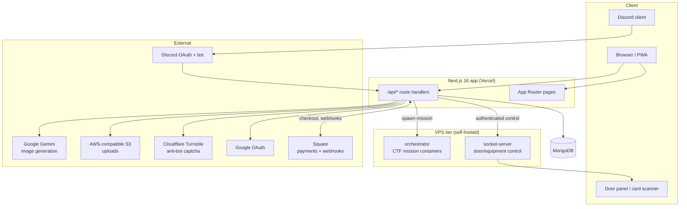

# Architecture Overview

> **Status:** Current — the foundation document for the architecture. Cross-document links use HTML anchors so they render as clickable links on GitHub.
> **Audience:** Engineers and operators who need the system's shape before working in it.  ·  **Last reviewed:** 2026-05-29

## Overview

The-Lab is the membership, community, and access-control platform for **Fab Lab Fort Smith** — a community makerspace. It handles member sign-up and onboarding, paid/sponsored memberships, a volunteer-hours and rewards ("stake") economy, a community showcase and bounty board, Discord integration, and **physical access control** (door unlock and access-card pairing for the lab's IoT door/equipment tier). It also hosts an intentionally-vulnerable capture-the-flag game, **"Hack the Lab"** (see <a href="#hack-the-lab-ctf">Hack the Lab</a>).

This document is the entry point to the architecture: the runtime topology, the major components and how a request flows through them, the trust boundaries, and the technology stack. Feature-level and API-level detail live in their own documents, indexed in the <a href="../README.md">documentation hub</a>.

## Prerequisites

- Familiarity with **Next.js (App Router)** and Node.js.
- For the access-control / CTF tiers: basic Docker and reverse-proxy (Traefik) concepts.
- Read <a href="../../CLAUDE.md">CLAUDE.md</a> for the engineering and secure-SDLC rules that govern changes to this system.

## System context

The platform is a single **Next.js 16** application (the web app + its API) backed by **MongoDB**, plus a separate **VPS tier** that drives physical hardware and the CTF mission containers. It integrates several third-party services for auth, payments, messaging, storage, and AI.



**Trust boundaries** (where untrusted input crosses into trusted execution):

1. **Browser → `/api/*`** — every API route authenticates and authorizes itself; `/api/*` is **not** covered by middleware, so each route calls `auth()` and enforces role/ownership at the edge. See <a href="#request-lifecycle">Request lifecycle</a>.
2. **Square → webhook** — inbound payment events are signature-verified (constant-time) and idempotent.
3. **App → VPS tier** — calls to the socket-server and orchestrator carry a bearer secret; the device tier rejects unauthenticated calls.
4. **App → MongoDB** — a single least-privilege connection; PII fields are encrypted at rest.

## Application architecture

### Layered API pattern

API features follow a strict layering so responsibilities stay separated and persistence is isolated:

```
route.js  →  controller.js  →  service.js  →  model.js  →  src/lib/database.js
(HTTP)       (auth + shape)    (business)     (persistence)  (single Mongo client)
```

- **`route.js`** — maps HTTP verbs to controller methods; thin.
- **`controller.js`** — authenticates (`auth()`), authorizes (role/ownership), validates/derives the request shape, and translates results to HTTP responses. Identity comes from the **session**, never a client-supplied field.
- **`service.js`** — business logic; calls its own models and other features' **services** (never another feature's model).
- **`model.js`** — the only layer that touches MongoDB, via `src/lib/database.js`.
- **`src/lib/database.js`** — a lazily-constructed singleton `MongoClient` (importing it has no side effects).

Reference implementations that follow this pattern well: `src/app/api/v1/bounties/*`, `src/app/api/v1/users/*`, `src/app/api/v1/admin/plans/route.js`. Cross-cutting helpers live in `src/lib` (e.g. `src/lib/mongoSanitize.js`, `src/lib/ssrf.js`, `src/lib/adminGuard.js`) and `src/utils`.

### Request lifecycle

```mermaid
sequenceDiagram
  participant C as Client
  participant R as route.js
  participant Ctl as controller.js
  participant Svc as service.js
  participant M as model.js
  participant DB as MongoDB

  C->>R: HTTP request (cookies/session)
  R->>Ctl: dispatch
  Ctl->>Ctl: auth() → session; authz (role/ownership)
  alt unauthenticated / unauthorized
    Ctl-->>C: 401 / 403
  else allowed
    Ctl->>Svc: call with derived, sanitized input
    Svc->>M: read/write
    M->>DB: query (PII encrypted; $-operators stripped)
    M-->>Svc: result
    Svc-->>Ctl: domain result
    Ctl-->>C: JSON (safe projection — no PII/hashes for non-owners)
  end
```

### Authentication & authorization

- **next-auth v5** (`auth.js`, `auth.config.js` at the repo root — the framework's required location) with **JWT sessions** and three providers: **Google**, **Discord**, and **Credentials** (email/password, bcrypt-hashed).
- Server code calls `auth()` to resolve the session; the user identity (`userID`, `role`) drives authorization.
- The user API centralizes its access policy in `src/app/api/v1/users/access.js` (privileged-role check, public-safe field projection, and a self-update field whitelist). Operational endpoints (seed/migration/test) are gated by `src/lib/adminGuard.js`.

### Data & persistence

- **MongoDB** via the single `src/lib/database.js` client. Collections include `users`, `bounties`, `bounty_ideas`, `notifications`, `plans`, `transactions`, `portfolio`, `badges`, and `processed_webhook_events` (webhook idempotency).
- **PII at rest:** member `email` and `phoneNumber` are encrypted; email also serves as a lookup key. The current scheme and the planned hardening (authenticated AES-256-GCM + a keyed HMAC blind index) are documented in the <a href="../migrations/sec-23-pii-encryption-gcm-blind-index.md">SEC-23 migration plan</a>.
- **Input safety:** body-driven writes strip Mongo `$`-operators (`src/lib/mongoSanitize.js`); user lookups escape/anchor regex input.

### Payments & memberships

Square powers checkout and recurring billing. Members subscribe to plans or are **sponsored** (gifted) by others; webhooks (`src/app/api/v1/square/webhooks/payment/route.js`) drive membership state — activating/renewing access, applying grace periods, and revoking on cancellation. Webhook handling is **signature-verified** (constant-time) and **idempotent** (`src/lib/webhookIdempotency.js`) so Square's at-least-once redelivery can't double-apply effects.

### Physical access control (IoT tier)

The `vps/` tier is self-hosted on a VPS, separate from the Vercel-deployed web app:

- **`vps/socket-server.js`** — controls door/equipment hardware over WebSockets. The app calls its authenticated control endpoints (bearer secret) to **unlock doors** and **pair access cards**; decisions are audit-logged.
- **`vps/orchestrator/`** — spawns per-user Docker containers for the "Hack the Lab" missions, fronted by Traefik. Untrusted `userID`/`missionID` are allowlist-sanitized before they reach container/volume/image names or Traefik rules (`vps/orchestrator/lib/sanitize.js`).

### Integrations

| Service | Purpose | Entry points |
|---|---|---|
| **Square** | Payments, subscriptions, webhooks | `src/lib/square.js`, `v1/square/*`, `v1/memberships/*`, `v1/donations/*` |
| **Discord** | OAuth, bot interactions, role sync, DMs | `auth.js`, `src/lib/discord.js`, `api/discord/interactions` |
| **Google** | OAuth sign-in | `auth.js` |
| **Cloudflare Turnstile** | Anti-bot captcha on register | `api/auth/register` |
| **AWS/S3** | Image uploads (server-keyed, validated) | `src/app/api/v1/upload/route.js`, `src/utils/s3.util.js` |
| **Gemini** (`@google/genai`) | Badge image generation | `v1/holodeck/generate-badge-images` |

## Hack the Lab (CTF)

The repo embeds an intentionally-vulnerable security game. Its zones — `vps/missions/**`, `src/app/dashboard/activities/terminal/**`, `src/app/api/v1/holodeck/**`, `src/app/api/v1/arcade/**`, `src/app/components/holodeck/**`, and the design docs in <a href="../game/GAME_DESIGN.md">docs/game/</a> — contain **deliberate** weaknesses, planted secrets, and flags. **They are game content, not defects**, and are out of scope for security findings. Real infrastructure and member data bordering this content must still be fully secure. (See `CLAUDE.md` §14.)

## Technology stack

| Layer | Technology |
|---|---|
| Web/API | Next.js 16 (App Router), React 19, JavaScript (path alias `@/*`) |
| Auth | next-auth v5 (JWT), bcryptjs |
| Data | MongoDB (Node driver v7) |
| Payments | Square SDK |
| Animation/UI | motion, inline styles / CSS variables |
| IoT tier | Node socket-server, Fastify orchestrator, Docker, Traefik |
| Tooling | ESLint (flat config), Jest, next-pwa |
| Hosting | Vercel (web app) + VPS (IoT/CTF tier) |

## Deployment topology

- **Web app** deploys to **Vercel**. (`.vercelignore` is currently empty, so nothing is excluded from the deployment by it — see the <a href="../guides/deployment.md">deployment guide</a>.) Configuration is environment-driven; required secrets are validated at startup and there are **no hardcoded fallbacks** for secrets or infra endpoints.
- **VPS tier** (`vps/`) is deployed separately to the makerspace's server, running the socket-server and orchestrator alongside Docker/Traefik.
- **CI** (`.github/workflows/ci.yml`) enforces `test` and `lint` on every PR; additional gates (build, SAST, dependency/secret scans) run report-only and flip to enforced as their backing remediations land. See <a href="../audit/05-engineering-process.md">the engineering process</a>.

## Related documents

- <a href="../README.md">Documentation hub</a> — index of all documentation.
- <a href="../../CLAUDE.md">CLAUDE.md</a> — engineering & secure-SDLC rules (authoritative for changes).
- <a href="../audit/06-security-standards.md">Security standards</a> — binding security standards.
- <a href="../migrations/sec-23-pii-encryption-gcm-blind-index.md">SEC-23 PII-encryption migration plan</a>.

## Changelog

| Date | Change | Author |
|------|--------|--------|
| 2026-05-29 | Initial version (foundation document) | app dev |
