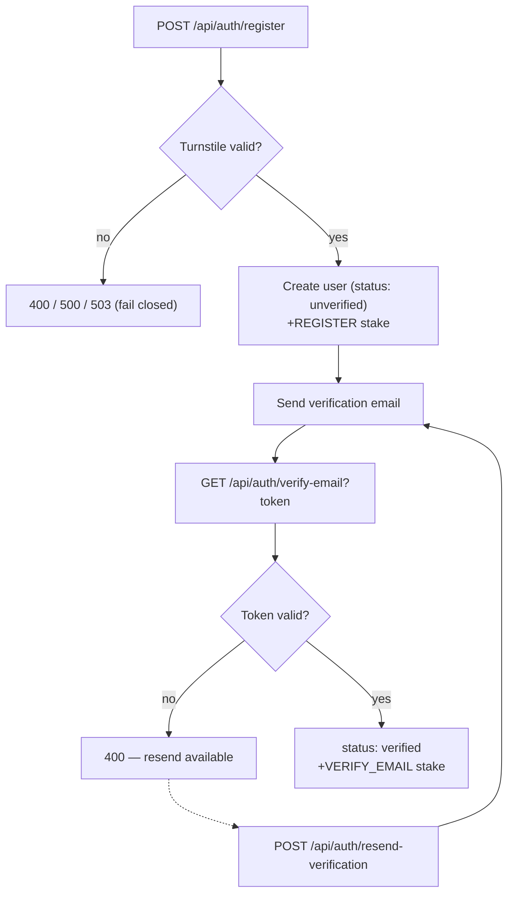
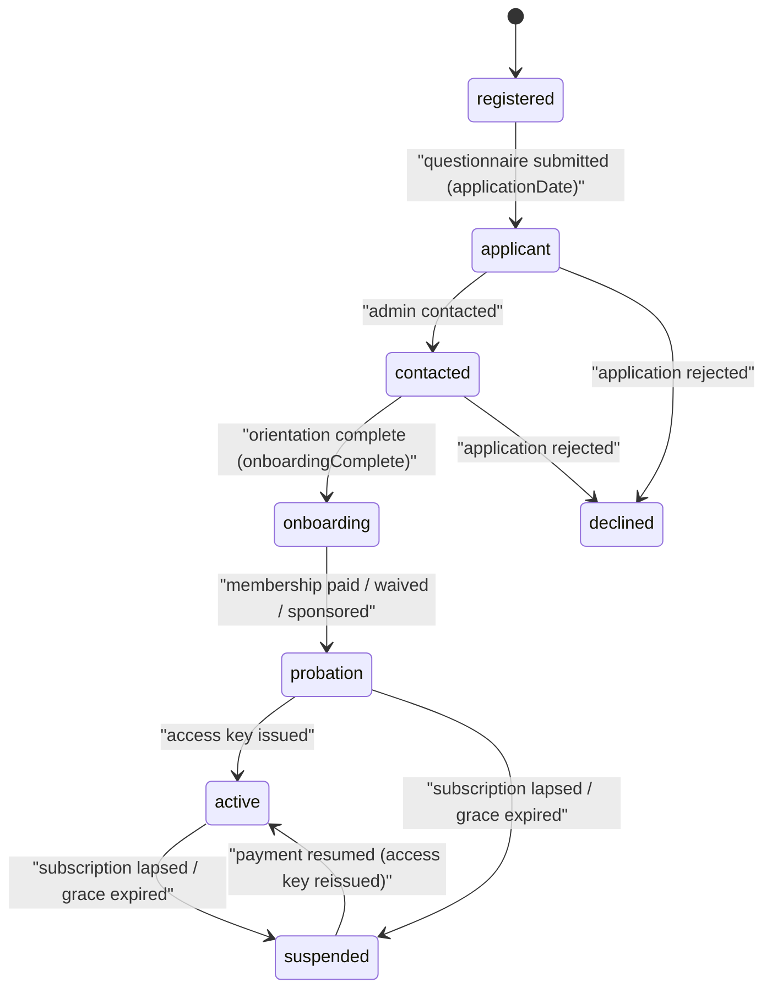

# Auth & Onboarding

> **Status:** Current — feature documentation for sign-up, email verification, and the membership-status progression. Cross-document links use HTML anchors so they render as clickable links on GitHub.
> **Audience:** Engineers and reviewers working on authentication, registration, or onboarding.  ·  **Last reviewed:** 2026-05-29

## Overview

This document describes how a person becomes an authenticated, onboarded member of The-Lab: the three sign-in providers, the Turnstile-gated email/password registration, the email-verification flow, and the membership-status state machine that carries a member from `registered` all the way to `active` (door access issued).

Authentication is **next-auth v5** with **JWT sessions**, configured at the repo root in `auth.js` and `auth.config.js` (next-auth's required location). The custom registration/verification endpoints live under `src/app/api/auth/*` and follow the layered `route → controller → service → model` pattern. Identity always derives from the **session**, never from a client-supplied field. See the <a href="../architecture/overview.md">Architecture Overview</a> for the request lifecycle.

## Prerequisites

- Familiarity with next-auth v5 (Auth.js) and JWT sessions.
- Read the authentication section of the <a href="../architecture/overview.md">Architecture Overview</a>.
- Onboarding ties into payments — see <a href="./memberships-payments.md">Memberships & Payments</a> for the subscription/sponsorship side.

## Sign-up & sign-in providers

next-auth is wired with three providers in `auth.js`:

| Provider | How it identifies the user | Account creation |
|---|---|---|
| **Google** (`GoogleProvider`) | OAuth `profile.email`, falling back to `profile.sub` (`googleId`) so a changed email never spawns a duplicate | Auto-creates a `verified` user via `AuthController.register(...)` if none exists |
| **Discord** (`DiscordProvider`, scopes `identify email guilds.join`) | Encrypted email first, then `discordId`; honors a signed `discord_link_for` cookie to attach Discord to an existing logged-in account instead of creating a "ghost" | Auto-creates a `verified` user; on a username clash it retries with an id suffix; on an email clash it links Discord to the existing account |
| **Credentials** (`CredentialsProvider`) | `identifier` (email **or** username) + password | Created out-of-band via `POST /api/auth/register`; `authorize()` proxies to `POST /api/auth/signin` |

On Discord sign-in, the `signIn` callback calls `DiscordService.addMemberToGuild(...)` to add the user to the lab's Discord guild, and `TransactionService.claimPendingTips(...)` claims any stake tips that were escrowed against that `discordId` (see <a href="./bounties-rewards.md">Bounties & Rewards</a>).

### Email/password registration (`POST /api/auth/register`)

The route handler (`src/app/api/auth/register/route.js`) is **public** and enforces a Cloudflare Turnstile gate before touching the database:

1. Require a `captchaToken` in the body (400 if missing).
2. Require `process.env.TURNSTILE_SECRET_KEY` — there is **no hardcoded fallback** (SEC-21). If unset, the route fails closed with a 500 ("Captcha verification is unavailable").
3. Verify the token against Cloudflare's `https://challenges.cloudflare.com/turnstile/v0/siteverify` endpoint (`secret` + `response` sent as a POST form body, bounded by a 5s timeout); reject with 400 on failure, or 503 if the Turnstile upstream errors or times out.
4. Delegate to `AuthController.register(data)` → `AuthService.register(...)`.

`AuthService.register` (`src/app/api/auth/[...nextauth]/service.js`) encrypts the email (and phone, if present), rejects duplicate email/username, bcrypt-hashes the password (cost 12 via `bcrypt.hash(password, 10)` rounds), constructs a `User`, seeds the `REGISTER` onboarding reward (`Constants.ONBOARDING_REWARDS.REGISTER` = 10 stake), and — for locally-registered (`unverified`) users — sends a verification email. The registration body and the verification token are **never logged** (SEC-20/SEC-24).

**Security:** A duplicate email surfaces as a generic 409 ("A user with this email already exists"); other failures return a generic message. Passwords, tokens, and decrypted PII are never written to logs.

### Sessions

`auth.config.js` configures a **JWT** session strategy with `maxAge` 30 days and `updateAge` 24 hours; the sign-in page is `/auth/signin`. The `jwt` callback in `auth.js` populates the token (`userID`, `role`, name, `username`, `image`, `discordId`), handles the account-merge scenario, records `lastLogin`, and **enforces grace-period expiry on login** (see <a href="./memberships-payments.md">Memberships & Payments</a>). The `session` callback projects those token fields onto `session.user`. The required `AUTH_SECRET` comes from the environment.

## Email verification

Local registrations are created with `status: 'unverified'` and a JWT `verificationToken` (15-minute expiry, signed in the `User` class). Two endpoints drive verification:

- **`GET /api/auth/verify-email?token=…`** (`verify-email/route.js`) → `AuthController.verifyEmail(token)` → `AuthService.verifyEmail(token)`. Looks the user up by token; on success sets `status: 'verified'`, clears the token, and awards `VERIFY_EMAIL` stake (10), appending a `stakeHistory` entry. Returns 400 for a missing or invalid/expired token.
- **`POST /api/auth/resend-verification`** body `{ email }` (`resend-verification/route.js`) → `AuthService.resendVerification(email)`. Looks up by encrypted email, rejects if already verified, regenerates a token, and re-sends the email.

**Note:** `AuthService.login` refuses credentials sign-in until `status === 'verified'` ("Please verify your email before logging in"). OAuth (Google/Discord) accounts are created already `verified`, so they skip this flow.

## Onboarding & membership-status progression

Beyond account verification, each user carries a `membership` sub-document (created in `src/app/api/v1/users/class.js`) that tracks their journey from a fresh registrant to an access-key-holding member. The `status` field moves through:

`registered → applicant → contacted → onboarding → probation → active`

(plus the terminal/side states `suspended` and `declined`).

The transition logic lives in `UsersService.updateUser` (`src/app/api/v1/users/service.js`). Unless the user is in a **manual** status (`probation`, `suspended`, or `declined`), status is **auto-derived** from membership flags on every update:

| Resulting status | Condition (evaluated in order) |
|---|---|
| `registered` | default — account exists, no application yet |
| `applicant` | `membership.applicationDate` set (the onboarding questionnaire was submitted) |
| `contacted` | `membership.contacted` true (an admin has reached out) |
| `onboarding` | `membership.onboardingComplete` true (safety orientation done) |
| `probation` | `onboardingComplete` **and** a paying/waived/sponsored membership exists (`isWaived` or a live `sponsorshipExpiresAt`) |
| `active` | `membership.accessKey.issued` true (admin issued the door key) |

Side effects on the way through:

- **Application submitted** (`applicationDate` first set) → awards `SUBMIT_APPLICATION` stake (10), emails the applicant a "received" confirmation, and notifies admins to review.
- **Status changes** → emails the member, and syncs their Discord membership role via `DiscordService.syncMembershipRole`.
- **Promoted to `probation`** → in-app "Complete Your Profile" notification to the member, plus an admin notification that an **Access Key** needs issuing.
- A manual `membership.status` in the update overrides the auto-calculation.

The status also drives `UsersService.nudgeUser`, which produces a context-aware next-step nudge (complete questionnaire → schedule orientation → subscribe → complete profile → log volunteer hours).

**Note:** `suspended` is reached from `active`/`probation` when a Square subscription is canceled/past-due or a grace period expires — that machinery is webhook- and login-driven and is documented in <a href="./memberships-payments.md">Memberships & Payments</a>. `active` requires an admin-issued access key, after which the member can pair a physical card (see the access-control tier in the <a href="../architecture/overview.md">Architecture Overview</a>).

## Onboarding stake rewards

Completing onboarding steps grants "stake" (the community rewards currency, see <a href="./bounties-rewards.md">Bounties & Rewards</a>). The amounts are defined in `src/lib/constants.js` (`Constants.ONBOARDING_REWARDS`):

| Step | Constant | Stake |
|---|---|---|
| Register an account | `REGISTER` | 10 |
| Verify email | `VERIFY_EMAIL` | 10 |
| Complete profile | `COMPLETE_PROFILE` | 10 |
| Submit membership application | `SUBMIT_APPLICATION` | 10 |
| Subscribe to a plan | `SUBSCRIBE` | 25 |

## Related documents

- <a href="../architecture/overview.md">Architecture Overview</a> — request lifecycle, auth model, trust boundaries.
- <a href="./memberships-payments.md">Memberships & Payments</a> — subscriptions, sponsorship, grace periods, and the webhook state machine that drives `active`/`suspended`.
- <a href="./bounties-rewards.md">Bounties & Rewards</a> — the stake economy that onboarding rewards feed into.
- <a href="../../CLAUDE.md">CLAUDE.md</a> — engineering & secure-SDLC rules.

## Changelog

| Date | Change | Author |
|------|--------|--------|
| 2026-05-29 | Initial version | app dev |
